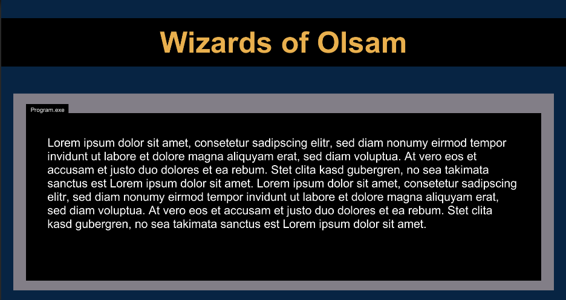
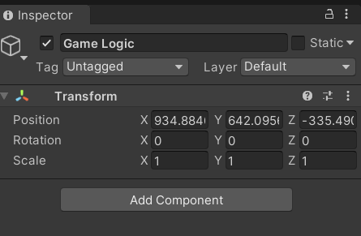
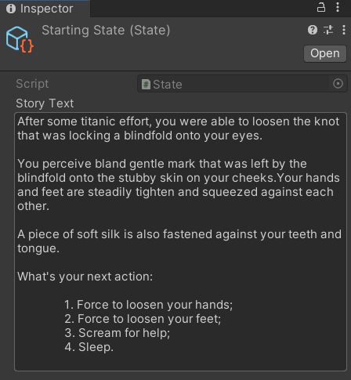

# [GameDev.tv](https://www.gamedev.tv/)'s Complete C# Unity Game Developer 2D on Udemy

A repository aimed to store the code and the notes generated from the lessons of [the course](https://www.udemy.com/course/unitycourse/).

I will not make a detailed dive into Object Oriented Programming, because this has already been discussed in my [learning Java repository](https://github.com/gagibran/udemy-java-the-complete-java-developer-course).

Refer to that [README.md](https://github.com/gagibran/udemy-java-the-complete-java-developer-course/blob/dev/README.md) to know more about OOP.

I will only list the main differences between C# and Java. Based on Mosh Hamedani's C# series, which include:

1. [C# Basics for Beginners: Learn C# Fundamentals by Coding](https://www.udemy.com/course/csharp-tutorial-for-beginners/);
2. [C# Intermediate: Classes, Interfaces and OOP](https://www.udemy.com/course/csharp-intermediate-classes-interfaces-and-oop/);
3. [C# Advanced Topics: Prepare for Technical Interviews](https://www.udemy.com/course/csharp-advanced/).

I will also include some exercises that I see fit from these courses. All of them made using .NET Core 5.

Since Unity projects are too large to be stored in GitHub, I will only keep this README.<span>md</span>, the LICENSE, and .gitignore here.

## Table of Contents:

- [Hello, world](#hello,-world)
    - [Requirements for this course](#requirements-for-this-course)
    - [First C# program](#first-c-program)
    - [Start method](#start-method)
    - [Update method](#update-method)
- [Number wizard](#number-wizard)
    - [Debug.Log](#debug.log)
    - [Player input](#player-input)
    - [Unity namespace](#unity-namespace)
    - [Solution](#solution)
- [Text101](#text101)
    - [Game design](#game-design)
    - [The game](#the-game)
    - [Creating sprites in Unity](#creating-sprites-in-unity)
    - [UI](#ui)
    - [Updating the text content](#updating-the-text-content)
    - [Game states](#game-states)
    - [Scriptable objects](#scriptable-objects)
    - [Linking the scriptable object to a variable](#linking-the-scriptable-object-to-a-variable)
    - [Storing the next states](#storing-the-next-states)
    - [Managing next states](#managing-next-states)
    - [Organizing state files](#organizing-state-files)
    - [TextMesh Pro and polish](#textmesh-pro-and-polish)
- [Differences between C# and Java](#differences-between-c-and-java)
    - [C# naming conventions](#c-naming-conventions)
    - [Namespaces](#namespaces)
    - [Data types](#data-types)
    - [Casting characters to integers](#casting-characters-to-integers)
    - [Strings](#strings)
    - [Converting types](#converting-types)
    - [Structs](#structs)
    - [Enums](#enums)
    - [Reference types and value types](#reference-types-and-value-types)
    - [Random number](#random-number)
    - [Returning in void](#returning-in-void)
    - [Access modifiers](#access-modifiers)

## Hello, world

### Requirements for this course
1. Unity Hub;
2. A version of Unity. I'm using **Unity 2020.2.5f1 (64-bit)**;
3. Visual Studio. I'm using **Visual Stdio 2019**.

### First C# program

We can start by creating a new project in Unity Hub. When it's done creating, the folder structure will look like this for a project named **HelloWorld**:


Under the folder **HelloWorld**.

In unity, we can create a C# file by right clicking in the **Assets** area, select **Create**, and select **C# Script**:


Right after clicking **Create**, we have to rename the file to something other than the default. In this case, **HelloWorld**:


We can choose to open it in Visual Studio by double clicking the file. The template C# script that's generated is:

```cs
using System.Collections;
using System.Collections.Generic;
using UnityEngine;

public class HelloWorld : MonoBehaviour
{
    // Start is called before the first frame update
    void Start()
    {
        
    }

    // Update is called once per frame
    void Update()
    {
        
    }
}
```

We can add a print statement in order to make it print out **Hello, world.**:

```cs
using System.Collections;
using System.Collections.Generic;
using UnityEngine;

public class HelloWorld : MonoBehaviour
{
    // Start is called before the first frame update
    void Start()
    {
        print("Hello, world");
    }

    // Update is called once per frame
    void Update()
    {
        
    }
}
```

After that, we have to attach it into a **game object**.

We can see all game objects in the left side view of Unity, in the **Hierarchy** pane:


Right now, the only object present is the **Main Camera**.

To attach our script to the **Main Camera** object, we can simply drag and drop the **HelloWorld** file from the **Assets** into **Main Camera** on the left side pane.

If we click on the object, we should see the script added in the **Inspector** pane, on the right side, in the bottom:


We can also click the **Add Component** button to attach a script there.

Finally, to execute our script, we have to click the **play button** in the upper middle section of Unity:


The message will be displayed into the **console view**:


To stop the current play session, we just have to click the **play button** again.

The console is an awesome tool for debugging.

### Start method

The start method is invoked when the game is initialized (when the play button is hit).

It's an initialization method. It only executes **once**.

But, we still have to declare **fields** to the class so that the [Update method](#update-method) can access them.

### Update method

This method is called **once per frame**.

So, for faster computers, this method will be called quicker.

## Number wizard

In this section, we'll create a console based C# game that guesses which number the user is thinking about.

### Debug.Log

This method of printing out is from the **UnityEngine** namespace.

It is more flexible and better than print. It will be later explained.

### Player input

We can read which key the player's pushed in a given situation.

The official documentation for Unity's API on that can be found [here](https://docs.unity3d.com/ScriptReference/Input.html).

To read an input, we need to use the **Input** class from the **UnityEngine** namespace.

Inside this class we have the overloaded method **GetKeyDown()** that takes an argument of type **KeyCode**.

This method reads which key an user pressed **down** in their keyboard.

Example to read the **up arrow**:

```cs
if (Input.GetKeyDown(KeyCode.UpArrow))
{
    Debug.Log("Up Arrow key was pressed.");
}
```

This has to go inside the [Update()](#update-method) method in the **NumberWizard** class, because this method constantly reads input from the user.

The message "Up Arrow key was pressed." will only be displayed **if we push the key after we click inside the Game tab**:


Here's a [list](https://docs.unity3d.com/ScriptReference/KeyCode.html) from the official documentation of all key codes that are available for reading.

**Note**: normally, we put the curly bracket starting a code block down bellow a statement in C#, like the example above.

### Unity namespace

We're using the **UnityEngine** namespace, that contains all classes, methods from the Unity framework.

A full documentation can be found [here](https://docs.unity3d.com/2020.2/Documentation/Manual/index.html).

### Solution

We create a project just like we did with the [hello, world](#hello,-world) challenge, create the C# file in **Assets**, and add the following code to it:

```cs
using System.Collections;
using System.Collections.Generic;
using UnityEngine;

public class NumberWizard : MonoBehaviour
{
    int max;
    int min;
    int guess;

    // Start is called before the first frame update
    void Start()
    {
        StartGame();
    }

    void StartGame()
    {
        max = 1000;
        min = 1;
        guess = 500;
        Debug.Log("Welcome to Number Wizard!");
        Debug.Log("Think of a number.");
        Debug.Log("The highest number is: " + max);
        Debug.Log("The lowest number is: " + min);
        Debug.Log("Tell me if your number is higher or lower than " + guess);
        Debug.Log("Press the up arrow if it's higher.");
        Debug.Log("Press the down arrow if it's higher.");
        Debug.Log("Press enter if the number is correct.");
        max += 1; // Now that the max is 1001, we can press the up arrow until it hits 1000, if our number is 1000.
    }

    // Update is called once per frame
    void Update()
    {
        if (Input.GetKeyDown(KeyCode.UpArrow))
        {
            min = guess;
            NextGuess();
        }
        else if (Input.GetKeyDown(KeyCode.DownArrow))
        {
            max = guess;
            NextGuess();

        }
        else if (Input.GetKeyDown(KeyCode.Return))
        {
            Debug.Log("Your number is " + guess);
            StartGame();
        }
    }

    void NextGuess()
    {
        guess = (max + min) / 2;
        Debug.Log("Is your number " + guess + "?");
    }
}
```

Trying to guess the number 643:


Something to note is that this game still has a major bug. When we hit up and down a certain amount of times, the minimum and maximum values will be equal, meaning that their mean will be equal themselves. In other words, when this condition is reached, we won't be able to update the value anymore and the **guess** variable will get stuck in a value.

## Text101

We'll be creating a text based game that the player chooses what will happen.

### Game design

It's important that the player have a feeling of discovery by choosing their own path through out the game.

The core mechanics of this game is that the player will be choosing their actions by selecting a text.

I'll try to make it a cyberpunk game, despite the theme being steampunk in the course.

It will be just a small project, just so that we get use to Unity's API and overall mechanics.

### The game

I created a repository to store the game's files, like Unity files, the story, the flow chart etc. It can be found [here](https://github.com/gagibran/wizards-of-oslam). In this section, I will describe the process used to create the game and the lessons learned.

### Creating sprites in Unity

According to the [documentation](https://docs.unity3d.com/Manual/Sprites.html), a sprite is a 2D graphic object obtained from a bitmap image.

To create a sprite in Unity, we just have to right click in the **Assets** area, select **Create**, just like we did to create the C# script, click **2D**, then **Sprites**, and finally, choose between **Square**, **Triangle**, **Diamond**, **Hexagon**, **Circle**, and **Polygon**:


Similarly to the adding a script into a game object, we can drag and drop a sprite into it. We can do it as many times as we want to add multiple sprites into a game object.

In their **Inspector** pane, we can change their color, move them around the scene pane (can also be done by clicking and dragging), add scripts etc:


They will appear into our hierarchy tree.

In the top right, we have a bunch of tools to mess around with the sprite, like **Hand Tool**, **Move Tool**, **Scale Tool**, **Rotate Tool**, and **Editor Tool**:


Despite this being a 2D course, the game scene can be changed to 3D as well:


Example of 2D:


**Challenge screenshot:**


### UI

The buttons, text, menus - everything that the player interacts with.

In Unity, the UI lives on the Canvas, which stays on the top layer in relation to the `Main Camera`.

We create a Canvas by going to `GameObject`, on the top menu, then `UI`, finally `Canvas`:


It creates a huge canvas, but its size doesn't matter, as it will stay on the top of our game.

The canvas adjusts itself to the size of our game window.

We can lock the game window at an aspect ration by clicking the `Game` panel, going to `Free Aspect`, and specifying a ratio:


For this game, we're selecting `Full HD (1920x1080)`.

We can create text on the canvas by right clicking the `Canvas` object in the hierarchy menu and selecting `Text`:


We can adjust it, change its color, its font size, the font family, spacing, rename it, and so on, just like any other game object.

We can adjust the text by going to the `Text` editor on the text object's `Inspector`.


We can create an `Image` object doing the same steps, but selecting `Image` in the `UI` section.

We can also change the hierarchy of the game objects (which one sits on top of which one) by dragging and dropping an object making it the first to be rendered in the hierarchy:


In this image, `Image` is rendered first than `Story Text`, making it sit on the bottom of the text.

We can also disable the game object by unselecting the check box near **Text**.

Here, `Image` and `Story Text` are the child of `Canvas`.

If we unselect `Canvas`, we make both its children invisible.

The final game screen for this Text101 game that I created:



### Updating the text content

We'll create a script that will dynamically change the text of the story.

First off, we need to create an empty game object to attach a script to it. We can do that by right clicking inside the `Hierarchy` pane, or clicking in the `GameObject` menu and selecting `Create Empty`:


The empty game object appears on the hierarchy pane like so:


I've renamed it to `Game Logic` to make it as clear as possible that the logic script will be attached to it.

In the `Inspector` view, we can see that this game object was created with a default `Transform` component. The values of this components specify where in the world our object will be placed:



It's always good practice to reset these values to 0 whenever we create a new empty object.

Secondly, we need to create an empty C# script and link it to `Game Logic`, just like we did [previously](#first-c-program).

In this newly created class, I called it `GameLogic.cs`, we need to create a local variable, inside the class, of type `UnityEngine.UI.Text`. This will be used as our link from the script to the engine to make changes to the story.

We also need to include the `UnityEngine.SerializeField.SerializeField()` [attribute](https://docs.microsoft.com/en-us/dotnet/csharp/programming-guide/concepts/attributes/) in front of our variable so that the link is properly done:


```cs
using System.Collections;
using System.Collections.Generic;
using UnityEngine;
using UnityEngine.UI;

public class GameLogic : MonoBehaviour
{

    // Local variable:
    [SerializeField] Text textComponent; // Serializing a field (or variable), making it available to edit into Unity. Using the data type UnityEngine.UI.Text.

    // Start is called before the first frame update
    void Start()
    {
        
    }

    // Update is called once per frame
    void Update()
    {
        
    }
}
```

Looking at our `Game Logic` game object's inspector now, we have a new field called `Text Component` that **references** the local variable with the same name that we just created:


This field's name was created based upon the name that we gave our variable. Unity automatically separated the string and capitalized it properly.

Now, to dynamically update the story text, we can drag and drop the game object `Story Text` into this field, or, click on the selector to the right of the field and select `Story Text`:


That's why we created the variable as of type `UnityEngine.UI.Text`, so that Unity knows that we're trying to link a text element to this particular variable.

Now, in the `Start()` method, we'll assign a `string` to the property `Text.text()`, which will, then, update  when we hit the play button with this string that we created:

```cs
using System.Collections;
using System.Collections.Generic;
using UnityEngine;
using UnityEngine.UI;

public class GameLogic : MonoBehaviour
{

    // Local variable:
    [SerializeField] Text textComponent; // Serializing a field (or variable), making it available to edit into Unity. Using the data type UnityEngine.UI.Text.

    // Start is called before the first frame update
    void Start()
    {
        textComponent.text = "Placeholder"; // Updating the game with this text when we click on the play button.
    }

    // Update is called once per frame
    void Update()
    {
        
    }
}
```

When we hit play:


### Game states

Here we'll learn about state machines.

A **state** is an action, process, or behaviour.

A **state machine** is composed of lots of states, but assumes only **one state at a time**.

We also have **conditions** that enable us to transition from one state to another.

A flowchart representing a finite state machine:


Here we have **3 states and one decision point**.

In a game, a state machine is much more complex, naturally.

Here, we need to create a **starting state**, which is the first thing the player is confronted when playing the game.

### Scriptable objects

`UnityEngine.ScriptableObjects` is a class within Unity that allows us to store data in stand alone assets.

It keeps mountains of data out of our scripts.

It is lightweight and convenient and can be used as a template for consistency.

We can select the content from a scriptable object to input into our game as needed:


We can begin creating a **scriptable object** by creating a new C# class and **not attaching it to any game objects**.

We need to change this class, here called `State.cs`, to make it **not inherit from the** `UnityEngine.MonoBehaviour` **class**.

This class, `UnityEngine.MonoBehaviour`, states that a C# script needs to be attached to a game object.

Instead, we'll inherit from the class `UnityEngine.ScriptableObject`.

Since this script is not linked to the game logic, we don't need the `Start()` and `Update()` methods.

We'll actually create instead a `string` local variable, which is also a [serialized field](#updating-the-text-content).

We can also specify another attribute called `UnityEngine.TextAreaAttribute.TextAreaAttribute()` to enlarge the text field area, that we will create shortly, so that we have better visibility when typing.

This attribute take in two arguments, the first one, is the minimum size that the text box will have, and the second one, is the minimum amount of lines that the text box will have until it creates a scroll bar.

At the top of our script, just above the class declaration, we need to also include the attribute `CreateAssetMenuAttribute.CreateAssetMenuAttribute()`, or, it's alias, `CreateAssetMenu()`.

We need to pass, as a `menuName` parameter, the name of the class that we want to make as a scriptable object. In our case, `State`.

This creates an option to create a `State` scriptable object in assets, in Unity.

The code:

```cs
using System.Collections;
using System.Collections.Generic;
using UnityEngine;

[CreateAssetMenu(menuName = "State")]
public class State : ScriptableObject
{
    [TextArea(14, 20)] [SerializeField] string storyText;
}
```

Now, in Unity, if we right-click inside the `Assets` pane, we can create a state, which is the **scriptable object** that we've just created:


This option, as previously said, was created by `[CreateAssetMenu(menuName = "State")]`.

If we check the `Inspector` pane, we can see that there's the `Story Text` field there, as mentioned before, in which we can put the starting text.

Similar to when we serialized a variable before, Unity converts the variable name to the field that we see inside the engine, when we inspect the `StartingState` scriptable object:



Each state that we create will have this serialized field by default, now.

Then, we can write our story text there instead of doing something like:

```cs
using System.Collections;
using System.Collections.Generic;
using UnityEngine;
using UnityEngine.UI;

public class GameLogic : MonoBehaviour
{

    // Local variable:
    [SerializeField] Text textComponent; // Serializing a field (or variable), making it available to edit into Unity. Using the data type UnityEngine.UI.Text.

    // Start is called before the first frame update
    void Start()
    {

        // Updating the game with this text when we click on the play button:
        textComponent.text = "After some titanic effort, you were able to loosen the knot that was locking " + 
                             "a blindfold onto your eyes.\n\nYou perceive bland gentle mark that was left by the blindfold " +
                             "onto the stubby skin on your cheeks.Your hands and feet are steadily tighten and squeezed " +
                             "against each other.\n\nA piece of soft silk is also fastened against your teeth and tongue.\n\n" +
                             "What's your next action:\n\n\t1. Force to loosen your hands;\n\t2. Force to loosen your feet;\n\t" +
                             "3. Scream for help\n\t4. Sleep.";
    }

    // Update is called once per frame
    void Update()
    {

    }
}
```

Here we had to concatenate strings, use special characters and save it all into just one variable, decreasing the quality of the readability of our code.

### Linking the scriptable object to a variable

Inside `State.cs`, we're gonna add a public getter method for the string that we created there, `storyText`:

```cs
using System.Collections;
using System.Collections.Generic;
using UnityEngine;

[CreateAssetMenu(menuName = "State")]
public class State : ScriptableObject
{
    [TextArea(20, 30)] [SerializeField] string storyText;

    // Getter:
    public string GetStateStory()
    {
        return storyText;
    }
}
```

Now, in `GameLogic.cs`, we can call this getter to access `storyText` and update `textComponent.Text` with it.

We first need to create another `SerializedField` for the starting state of our game, in our `Game Logic` object. 
To store the `StartingState` that we created in `Assets`.

Thus, in `GameLogic.cs`, we create a variable called `startingState`, of type `State` (the class we created) and set it as a `[SerializedField]`:

```cs
using System.Collections;
using System.Collections.Generic;
using UnityEngine;
using UnityEngine.UI;

public class GameLogic : MonoBehaviour
{

    // Serializing a field (or variable), making it available to edit into Unity. Using the data type UnityEngine.UI.Text:
    [SerializeField] Text textComponent;
    [SerializeField] State startingState;


    // Start is called before the first frame update
    void Start()
    {

        // Updating the game with this text when we click on the play button:
        textComponent.text = "";
    }

    // Update is called once per frame
    void Update()
    {
        
    }
}
```

When we go back to inspect `Game Logic` in Unity, we see that there' now a field called `Starting State`, just beneath `Text Component`.

We'll attach the scriptable object `StartingState.asset` that we created there by dragging it from `Assets` into this field:


Afterwards, we'll create a variable called `state`, of type `State` in `GameLogic.cs`, which holds the current state that we are, so that we can access `GetStateStory()` within this script.

At the start of the game, that state needs to be the starting state. Thus, we assign `state = startingState`, which comes from the serialized field in `StartingState.asset`, and we also initialize `textComponent.text = startingState.GetStateStory()` in `Start()`, which will print out the starting state when we start the game:

```cs
using System.Collections;
using System.Collections.Generic;
using UnityEngine;
using UnityEngine.UI;

public class GameLogic : MonoBehaviour
{

    // Serializing a field (or variable), making it available to edit into Unity. Using the data type UnityEngine.UI.Text:
    [SerializeField] Text textComponent;
    [SerializeField] State startingState;

    // Declaring the current state variable:
    State state;

    // Start is called before the first frame update
    void Start()
    {
        // Initializing the current state with the starting one.
        // This has to be done in order to "state" to have a value. In this case, the value comes from the serialized field:
        state = startingState;

        // Updating the game with this text when we click on the play button:
        textComponent.text = startingState.GetStateStory();
    }

    // Update is called once per frame
    void Update()
    {

    }
}
```

**It is very important to initialize `state` here, otherwise when we update it later on, in the `Update()` method, we'll get a `NullReferenceException`, meaning that `state` was never initialized.**

Now, when we click the play button in Unity, we get:


Recapitulating our steps so far:
1. We created the `Game Logic` game object in Unity and `GameLogic.cs`;
2. We attached `GameLogic.cs` to `Game Logic`;
3. We created a scriptable object script called `State.cs`, which inherits from `ScriptableObject`;
4. We created a serialized field there called `storyText`;
5. We created a scriptable object in Unity, which is the starting state of our game, `StartingState.asset`;
6. There, we put our starting state text;
7. We created our first state in `GameLogic.cs`, which is the variable `startingState` and it's serialized in Unity.
8. We created the `state` variable, which will be later updated;
9. We attached `StartingState.asset` to the serialized `Starting State` field in `Game Logic`;
10. We created a getter for the serialized variable `storyText` in `StartingState.cs`;
11. We assigned `textComponent.text` to `startingState.GetStateStory()`, which returns the current state of the story.

### Storing the next states

Right now, need to think of a way to store all of the next states in our game. For that, we can use an array.

This array will be created in `GameLogic.cs` and it will have a getter associated.

Since we want to get the next **states**, this array will be of the same type of its parent class, `State`.

Thus, each element of this array will have access to `GetStateSTory()`, which returns `storyText`.

This array will also be serialized, so that we can store the next states in a state file:

```cs
using System.Collections;
using System.Collections.Generic;
using UnityEngine;

[CreateAssetMenu(menuName = "State")]
public class State : ScriptableObject
{
    [TextArea(20, 30)] [SerializeField] string storyText;
    [SerializeField] State[] nextStates; // Storying the next states. The contents of this array will have access to storyText.

    // Getters:
    public string GetStateStory()
    {
        return storyText;
    }
    public State[] GetNextStates()
    {
        return nextStates;
    }
}
```

Now, if we inspect `StartingState.asset` again:


I actually grouped state 1 and 2 in `1. Force to loosen your hands and feet;` for the sake of simplicity.

We can see that a list was created. Now, we can store the four states that this starting one leads to:

1. Force to loosen your hands;
2. Force to loosen your feet;
3. Scream for help.

I created the next states for these options:


Now, we have to define the size of this array to `4`, by changing the default `0` on the far right. Then, we can drag and drop all of our states to this list:


### Managing next states

In the final version of my game, I reduced the choices to only 2, otherwise the game would take to long to make.

Now we need to [read the player's input](#number-wizard) in order to know which state we need to go to:

```cs
using System;
using System.Collections;
using System.Collections.Generic;
using UnityEngine;
using UnityEngine.UI;

public class GameLogic : MonoBehaviour
{

    // Serializing a field (or variable), making it available to edit into Unity, in "Game Logic". Using the data type UnityEngine.UI.Text:
    [SerializeField] Text textComponent;
    [SerializeField] State startingState;

    // Declaring the current state variable:
    State state;

    // Start is called before the first frame update
    void Start()
    {
        // Initializing the current state with the starting one.
        // This has to be done in order to "state" to have a value. In this case, the value comes from the serialized field:
        state = startingState;

        // In the beginning, state will be the starting state:
        // Updating the game with this text when we click on the play button:
        textComponent.text = startingState.GetStateStory();
    }

    // Update is called once per frame
    void Update()
    {
        ManageState();
    }

    // Storying the next states of a state within an array:
    private void ManageState()
    {
        State[] nextStates = state.GetNextStates();
        string stateName = state.GetStateName();

        // If the player is close to a game over or winning the game:
        if (stateName.Equals("Sleep") || stateName.Equals("HitemWithHead") || stateName.Equals("RushToExit") || 
            stateName.Equals("ContinueExploring") || stateName.Equals("ConnectIntoTheMatrix"))
        {

            // If the player hits the "enter" key:
            if (Input.GetKeyDown(KeyCode.Return))
            {
                state = nextStates[0];
            }
        }

        // If the player is in a normal state:
        else
        {

            // If the player types "1" or "2" in their keyboard:
            if (Input.GetKeyDown(KeyCode.Alpha1))
            {
                state = nextStates[0];
            }
            else if (Input.GetKeyDown(KeyCode.Alpha2))
            {
                state = nextStates[1];
            }
        }

        // Updates the next state:
        textComponent.text = state.GetStateStory();
    }
}
```

The method `ManageState()`, which is called once per frame in `Update()`, updates the `state` variable by accessing the `nextStates` array, that's being currently held in the scriptable object of that state.

If the player presses `1`, or `2`, it goes to that state.

I also created a condition to check if the state names are `Sleep`, `HitemWithHead`, `RushToExit`, `ContinueExploring`, or `ConnectIntoTheMatrix`, because these states, in my game, lead to game over and the good ending. If the player is in one of these states, they have to hit `Enter` instead of `1` or `2`.

To get the name of a `State`, I created a getter called `GetStateName()` in `State.cs`, which returns the property `Object.name`, a `string` with the name of the `State`:

```cs
using System.Collections;
using System.Collections.Generic;
using UnityEngine;

[CreateAssetMenu(menuName = "State")] // Creates a "State" option in "Create", in Assets.
public class State : ScriptableObject
{
    [TextArea(20, 30)] [SerializeField] string storyText;
    [SerializeField] State[] nextStates; // Storying the next states. The contents of this array will have access to storyText.

    // Getters:
    public string GetStateStory()
    {
        return storyText;
    }
    public State[] GetNextStates()
    {
        return nextStates;
    }

    // Added this getter:
    public string GetStateName()
    {
        return name;
    }
}
```

I also changed the `StartingState` scriptable object to `InsideTheCultShop`. But again, all of the changes, the source code, the objects, and other assets can be found [in the game's GitHub repository](https://github.com/gagibran/wizards-of-oslam).

When hit play, when hitting `1` we get:


### Designing game flow

It's important to write our game and design the various states that it has beforehand.

A nice tool to create a story flow is app.diagrams.net, formerly known as draw.io. It creates a flow chart as a PNG, XML, HTML and some other options. I personally prefer the HTML option.

### Organizing state files

We can create new folders to better organize our assets. Here, it's good practice to store our scripts under a new folder `Assets/Scripts` and our states in a new folder called `Assets/States`.

Here, I also renamed the state files to append their state number at the beginning of the name, to make it more clear which state is which. I also changed `GameLogic.cs`'s if-statement that checks if it's at the end of the game to accommodate the changes:

```cs
...
if (stateName.Equals("S7_Sleep") || stateName.Equals("S9_HitemWithHead") || stateName.Equals("S11_RushToTheExit") ||
    stateName.Equals("S12_ConnectIntoTheMatrix") || stateName.Equals("S13_ContinueExploring"))
...
```

In the lesson, they separate the states further into sub folders, but I don't think it's necessary here.

### TextMesh Pro and polish

At this step, we can polish the game, by adding a menu with "New Game", "Manual" etc.

We can also use **TextMesh Pro**, which is a built-in package that deals with text polishing. It can be accessed by going to `Window/textMash Pro`:


We can also add packages to our project by accessing the `Package Manager`, also in `Window`, as seen in the picture above. In the `Package Manager`, we can also see which packages are imported to our project, which are available to be updated, and we can install more.

Back to `TextMesh Pro`, we can create new font assets by clicking `Font Asset Creator`. If it's the first time clicking it, it will ask to import TextMesh Pro (TMP) essentials and extras. Just click `Import` for both options and we're set to go.

The creator screen looks like this:


We need to feed in a font inside so that it creates an asset from it.

A good place to get fonts is [DaFont.com](https://www.dafont.com/).

I searched for a cyberpunk themed font there and found a nice looking one called **Cyberpunk Is Not Dead** by [Mihajlo Vitezović](https://www.dafont.com/pt/mihajlo-vitezovic.d2945), which will be used for the title of the game, and **Windows Command Prompt**, by [McFood](https://www.dafont.com/mcfood.d4318), which will be used as the story text.

In Unity, we can create a folder called `Assets/Fonts` to store any custom fonts there. Then we just have to drag and drop the font file into this folder (in my case, the files are called `CIND.otf` and `windows_command_prompt.ttf`).

Afterwards, we go into the `Font Asset Creator`, drag and drop the font to `Source Font File`, then click on `Generate Font Atlas`:


Once its done generating, we'll see a success message in the output window. We then hit `Save`


Now, inside the `Fonts` folder, we have a `<previousName> SDF.asset` file, which is the font converted into asset. In my case, I replaced the whitespace with a underscore and called them `CIND_SDF.asset` and `windows_command_prompt_SDF.asset`.

Now, we right-click on `Canvas`, in the hierarchy menu, an select `UI/TextMesh Pro - Text`


A new game object called `Text (TMP)` will be created, which is a text box with the font that we just imported. We can retype the text that we want there and replace it in the game:


We can delete the `Title Text` object and make this one our new title text. In its `inspector`, we can attach the newly created asset font to the element by dragging and dropping it to `Font Asset` in the `Main Settings`:


Since I changed the `Story Text` game object to TMP, I had to make a few changes in `GameLogic.cs` in order to make it work properly.

There, we defined the serialized field `textComponent` to be of type `UnityEngine.UI.Text`, but now, it's of type `TMPro.TextMeshProUGUI`. If we don't make this change, **we won't be able to attach the TMP game object to `Text Component` in the `Game Logic` object:

```cs
...
using TMPro;

public class GameLogic : MonoBehaviour
{
    [SerializeField] TextMeshProUGUI textComponent;
...
```

Now, we can attach a TMP game object in `Text Component`, in `Game Logic`:


## Differences between C# and Java

### C# naming conventions

Most of the naming is in PascalCase.

[Here](https://docs.microsoft.com/en-us/dotnet/standard/design-guidelines/naming-guidelines) is Microsoft's official naming convention for the C# language.

[Here](https://docs.microsoft.com/en-us/dotnet/csharp/programming-guide/inside-a-program/coding-conventions) is Microsoft's official coding convention.

[Here](https://github.com/ktaranov/naming-convention/blob/master/C%23%20Coding%20Standards%20and%20Naming%20Conventions.md) is a repository from [Konstantin Taranov](https://github.com/ktaranov) that condenses all of the conventions.

### Namespaces

They are containers for related classes.

They are declared using PascalCase:

```cs
namespace HelloWorld
{
    public class Program
    {
        public void Main(string[] args)
        {
            Console.WriteLine("Hello, world.");
        }
    }
}
```

We can import namespaces by using the keyword `using` at the beginning of our program. For example:

```cs
using System;
```

### Data types

They behave just like Java, but each data type is a struct mapped to the .NET primitives.

Here is the [official documentation](https://docs.microsoft.com/en-us/dotnet/csharp/language-reference/builtin-types/built-in-types) with all primitive types and their ranges.

They all belong to the `System` namespace.

The most used ones:
- `byte` maps to `System.Byte` and occupies 1 byte;
- `short` maps to `System.Int16` and occupies 2 bytes;
- `int` maps to `System.Int32` and occupies 4 bytes;
- `long` maps to `System.Int64` and occupies 8 bytes;
- `float` maps to `System.Single` and occupies 4 bytes;
- `double` maps to `System.Double` and occupies 8 bytes;
- `decimal` maps to `System.Decimal` and occupies 16 bytes;
- `char` maps to `System.Char` and occupies 2 bytes;
- `bool` maps to `System.Boolean` and occupies 1 byte.

Thus, an `int`, for example, can be declared as `System.Int32 number = 2;`.

Floats and decimals required that we use the keyword `f` and `m`, respectively, in order to not use the system's default, which is `double`.

Decimals have a higher range, so they're more precise than doubles.

The maximum and minimum values of each data type can be checked by accessing their constant variables in each struct, which is `MinValue` and `MaxValue`.

Another difference is that we can user the keyword `var` to create a variable implicitly in the body of a method, instead of explicitly declaring their data type, and the compiler will be able to assign the correct data type and allocate the necessary amount of memory to it. But, we have to keep in mind that `var number = 2;` won't default to `byte` or `short`, but it will default to `int`, unless the number is to big or too small to fit into it. Same with floating numbers, it defaults to `double`.

To create a constant value, we use the `const` keyword. Constants use the PascalCase instead of SCREAMING_CAPS.

### Strings

They're also mapped to a class in the `System` namespace, the `String` class.

They're immutable, meaning that they cannot be changed once declared.

We can iterate though a string by indexing it:

```cs
string name = "Gabriel";
Console.WriteLine(name[0]);
// name[1] = b; // This won't compile.
```

Which prints:

```
G
```

We can use string concatenation, but we can also use the static `Format()` method from the `String` class:

```cs
int a = 1;
bool b = true;
string s = string.Format("a is {0} and b is {1}.", a, b);
Console.WriteLine(s);

```
Which prints:

```
a is 1 and b is true.
```

We see here that the place holders inside the curly braces are 0-indexed.

We don't actually need to use the `Format()` when passing strings to `Console.Write()` or `Console.WriteLine()`. We can straight up pass the string and the arguments there:

```cs
int number = 2;
Console.WriteLine("Number: {0}.", number);
```

This prints:

```
Number: 2.
```

We can also join elements from an array or list using the `Join()` method, also in the `String` class:

```cs
int[] a = new int[3] { 1, 2, 3, 4 };
string s = string.Join(",", a);
Console.WriteLine(s);
```

Which prints `a`'s elements joined by a comma:

```
1,2,3,4
```

We also have the `Split()` method, which returns an array of elements separated by the argument passed into the method, of the original string:

```cs
static void GetMax()
    {
        Console.WriteLine("Enter numbers separated by comma:");
        string[] numbersStr = Console.ReadLine().Split(",");
        int currentMax = int.MinValue;
        foreach (string numberStr in numbersStr)
        {
            int number = int.Parse(numberStr);
            if (number > currentMax)
            {
                currentMax = number;
            }
        }
        Console.WriteLine("Max number: {0}.", currentMax);
    }
```

There's also a special type of string called **verbatim strings**, which are the pure strings, without the use of special or escape characters. For example: `string s = "\n";` jumps a line and in `string a = "variable\\holding\\a\\path";` we have to escape the backslash in order to use it.

We can simply append a `@` sign at the beginning of our string to use the escape character literally: `string s = @"\n";` equals `\n` literally. The path variable can now be declared as `string a = @"variable\holding\a\path";`. We can even type `Enter` to physically input a new line in the string, instead of using `\n`.

We can get input from the user by using `Console.ReadLine()`, which gets the input and converts it into a string. Thus, we have to assign it to a `string` variable.

### Converting types

We have **implicit** and **explicit** conversions.

In implicit, it converts as long as there's not information loss, like `byte a = 3;` and `int b = a;`, or `float c = 4;` and `int d = c;`

But, we cannot convert `int a = 1;` to `byte b = c;`, because `int` occupies 4 bytes, whereas `byte`, occupies just one. Even though the number `1` fits into a `byte`, the compiler treats it as information loss and doesn't compile.

In these cases, we can use the **explicit** conversion type, or **casting**, which is just like Java: `int a = 1;` and `byte b = (byte) a;`.

To convert a `string` to an `int`, for example, we can use the methods from the `Convert` class from the `System` namespace:

```cs
using System;

string s = "1";
int i = Convert.ToInt32(s);
```

All primitive types have overloaded methods for conversion, that accept each primitive type as an argument.

We can also use the static `Parse` method from each primitive type struct:

```cs
string s = "1";
int i = int.Parse(s);
```

### Casting characters to integers

Since a character is represented by a number when CLR runs, we can actually cast a `char` to an `int`:

```cs
char a = 'a';
int numA = (int) a;
```
Which prints out "97".

This maps to an [ASCII table](https://www.ascii-code.com/)

The reverse also works:

```cs
int numA = 97;
char a = (char) numA;
```

Which prints out `a`.

Another important thing to note is that, instead of concatenating, when we do math operations with a `char` and a number (any number data type), CLR automatically converts the `char` to its related ASCII number and does the operation.

Thus:

```cs
Console.WriteLine('a' + 10);
```

Returns `107`.

### Structs

It's a container in C# that's similar to a class.

They're not really used - we use classes 99% of the time.

They combine related fields and methods together.

There are a lot of tiny differences between classes and structs that's in the [official documentation](https://docs.microsoft.com/en-us/dotnet/csharp/language-reference/builtin-types/struct), but they're not very important to know.

What we should take from **structs**, is that we should use them when we want to create a small lightweight object. For example:

```cs
public struct RgbColor
{
    public int Red;
    public int Green;
    public int Blue;
}
```

It's more efficient to define it as a structure, when we need to create thousands of objects.

### Enums

This data structure is also present in Java.

We create enums when we want to encapsulate similar constant values. It's like a container just for constants.

It works just like a class.

We can create one using the keyword `enum`.

Example: instead of declaring multiple constants like:

```cs
const int RegularAirMail = 1;
const int RegisteredAirMail = 2;
const int Express = 3;
```

We declare a `enum` block:

```cs
public enum ShippingMethod
{
    RegularAirMail = 1,
    RegisteredAirMail = 2,
    Express = 3
}
```

Notice that we didn't have to explicitly specify the data type, because their integers by default.

We can change the data type to **another numeric data type only** using a colon:

```cs
public enum ShippingMethod : byte
{
    RegularAirMail = 1,
    RegisteredAirMail = 2,
    Express = 3
}
```

If we don't specify the values of the constants, the first member will be automatically assigned to 0, and from there, every member's value will be increased by one:

```cs
public enum ShippingMethod
{
    RegularAirMail, // 0.
    RegisteredAirMail, // 1.
    Express // 2.
}
```

But it's best practice to always give these constants a value.

We can access the enums using the dot notation and assigning it's value to a enum type, since it works like a class:

```cs
public enum ShippingMethod
{
    RegularAirMail = 1,
    RegisteredAirMail = 2,
    Express = 3
}

ShippingMethod method = ShippingMethod.Express;
```

Or, just use `var`:

```cs
var method = ShippingMethod.Express;
```

If we print this variable with `Console.WriteLine()`, we get:

```
Express
```

Which is the name of the constant.

By default, `Console.WriteLine()` **always converts it's argument into a string**. So, if we want to convert the type of this enum from `ShippingMethod` to an actual `string` without printing it, we can use the `ToString()` static method from the `System.Enum` abstract class:

```cs
var methodString = method.ToString();
```

The other around also works. We can also parse a `string` into a `ShippingMethod` using the overloaded `Parse()` static method, also from  from the `System.Enum` abstract class:

```cs
Object shippingArgument = Enum.Parse(typeof(ShippingMethod), "Express"); // Or var shippingArgument = ...
```

Here we used the `typeof` alias to the class `System.Type`, which returns the type of data from that enum (`NamespaceThatIamIn.ShippingMethod`), which is the first argument of this `Parse()` method, and we pass in the `string` that we want to search in the `enum` as the second argument. This prints out:

```
Express
```

If the argument wasn't in `ShippingMethod`, it would've not compiled and thrown us an error.

Notice that `Parse()` returns an `System.Object` type, which is a class in the `System` namespace.

To get the actual value from the constant, we need to cast it to an integer:

```cs
var methodValue = (int) method;
```

Printing this out, we get:

```
3
```

We can also map the values back to the constants by converting them into the enum type:

```cs
Console.WriteLine((ShippingMethod) 2);
```

Prints out:

```
RegisteredAirMail
```

If the value doesn't exist inside the enum, we get the number back:

```cs
Console.WriteLine((ShippingMethod) 4);
```

Returns:

```
4
```

### Reference types and value types

As we learned, all primitive types are [structures](#structs), since they are very small and take no more than some bytes, and arrays, [strings](#strings), and custom classes are classes.

All [structures](#structs) are **value types** and all classes are **reference types**.

When we create a **value type**, we allocate memory **automatically** on the **stack** for it. When we get out of this value's scope, the value is immediately removed from the memory.

With reference types, we need to allocate memory **manually**. We can do that by using the **new** keyword and the value is allocated on the memory **heap**.

Unlike stack, the heap is more sustainable. Thus, whenever we go out of scope, the value will continue to exist for a little while. It won't be removed immediately.

There's a process called garbage collection that' done by the [CLR](https://docs.microsoft.com/en-us/dotnet/standard/clr) (or runtime) that takes care of this.

So, once in a while, the CLR searches for objects that are no longer in use and removes them from the heap.

Example of **value types**. Here we're using a [struct](#struct) (integers):

```cs
using System;

namespace CSharpLearning
{
    class Program
    {
        static void Main(string[] args)
        {

            // Value types:
            var a = 10;
            var b = a;
            b++;
            Console.WriteLine(string.Format("a: {0}; b {1}.", a, b)); // a is 10; b is 11.
        }
    }
}
```

Here, `b` **copied** `a`. Thus, they're independent from each other.

Now, an example of **reference types** using classes (arrays):

```cs
using System;

namespace CSharpLearning
{
    public enum ShippingMethod: long
    {
        RegularAirMail = 1,
        RegisteredAirMail = 2,
        Express = 3
    }
    class Program
    {
        static void Main(string[] args)
        {

            // Reference types:
            var arrayOne = new int[3] { 1, 2, 3 };
            var arrayTwo = arrayOne;
            arrayOne[0] = 0;
            Console.WriteLine(string.Format("arrayOne[0]: {0}; arrayTwo[0] {1}.", arrayOne[0], arrayTwo[0])); // 0 and 0.
        }
    }
}
```

Here, the first elements of both arrays were changed. That's because we only allocated memory **once** for both arrays, that was when `arrayOne` was created. When we assigned the value of `arrayTwo` to `arrayOne`, we actually just **pointed** `arrayTwo` to the same memory address of `arrayOne`, on the heap.

Thus, when the contents of `arrayOne` were changed, it also changed for `arrayTwo`, because in fact, they are **the same array**.

Another example:

```cs
using System;

namespace CSharpLearning
{
    public class Person
    {
        public int Age;
    }
    class Program
    {
        public static void Increment(int number)
        {
            number += 10;
        }
        public static void MakeOld(Person person)
        {
            person.Age += 10;
        }
        static void Main(string[] args)
        {
            var number = 1;
            Increment(number);
            Console.WriteLine(string.Format("The number variable is {0}.", number)); // This value will still be 1.
            var person = new Person() { Age = 20 };
            MakeOld(person);
            Console.WriteLine(string.Format("The value of person.Age is: {0}.", person.Age)); // This value will now be 10.
        }
    }
}
```

Here, we created two static methods inside the `Program` class. When calling the `Increment()` method on the `number` integer variable, we **make a copy** of `number` inside the method, allocating new memory in the stack, therefore, change the variable **just inside the method**. Thus, our `number` variable remains unaltered.

Now, when we apply the method `MakeOld()` to increase the field `Age` of the `Person` class. Here, we don't make any copies of the created `person` variable, because it's been created with the `new` keyword and it's allocated in the heap.

Instead, a reference to `person` is passed inside the `MakeOld()` method, which points to the same memory address of `person`. Thus, the age will be incremented by 10, making it 30.

That notation when we created the object is the **object initialization syntax**, and with it, we can quickly initialize public fields when allocating a class to the heap.

### Random number

We can create random numbers by using the `System.Random` class.

It has an overloaded constructor that allows us to input a seed to generate random number from, so that our numbers are not "that random".

We can create an object for this class and use its methods.

Some of them are `System.Random.Next()`, which returns a random integer, respecting the wrapper class' maximum and minimum values.

This method has an overload, that allows us to input a maximum and minimum value - a range that we want our number to be generated from.

Adding an integer to the resulting random number on the interval offsets the whole interval. Thus, [doing operations with a `char` and casting the result back to a `char`](#casting-characters-to-integers) allows us to make some sort of random password generation.

For this generator, because stings are immutable objects, we cannot create an empty string and concatenate it with each new password character generated in the loop. Thus, we have to assign them into a buffer array, and then, when creating a new `string`, we can use one of its overloaded constructors that accepts an array of `char`:

```cs
using System;

namespace CSharpLearning
{
    class Program
    {
        static void Main(string[] args)
        {
            var randNum = new Random();
            const int passwordLength = 10;
            Console.WriteLine("Starting loop...");
            var buffer = new char[passwordLength];
            for (int i = 0; i < passwordLength; i++)
            {
                buffer[i] =(char) ('a' + randNum.Next(0, 26));
            }
            var randomPass = new string(buffer);
            Console.WriteLine(randomPass);
        }
    }
}
```

We have also `System.Random.NextBytes()`, `System.Random.NextBytes()`, `System.Random.NextDouble()` and so on.

### Returning in void

We can use the `return` keyword in a void method followed by no information to break out of the method:

```cs
static void ExerciseThree()
    {
        int randomInt = new Random().Next(1, 11);
        Console.WriteLine("Guess a number between 1 to 10. You have 4 tries:");
        for (int i = 0; i < 4; i++)
        {
            Console.Write(string.Format("Try {0}: ", i + 1));
            int guess = Convert.ToInt32(Console.ReadLine());
            if (guess == randomInt)
            {
                Console.WriteLine("You won! The number was {0}", randomInt);
                return;
            }
        }
        Console.WriteLine("You lost. The number was {0}.", randomInt);
    }
```

### Access modifiers

If we don't specify one, methods are `public` by default.