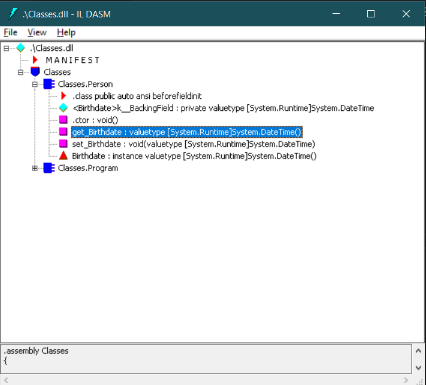

# [Mosh Hamedani](https://programmingwithmosh.com/)'s C# Courses

A repository aimed to store the code and the notes generated from the lessons of the courses

I will not make a detailed dive into Object Oriented Programming, because this has already been discussed in my [learning Java repository](https://github.com/gagibran/learning-java).

Refer to that [README.md](https://github.com/gagibran/learning-java/blob/dev/README.md) to know more about OOP.

I will only list the main differences between C# and Java.

The courses are:

1. [C# Basics for Beginners: Learn C# Fundamentals by Coding](https://www.udemy.com/course/csharp-tutorial-for-beginners/);
2. [C# Intermediate: Classes, Interfaces and OOP](https://www.udemy.com/course/csharp-intermediate-classes-interfaces-and-oop/);
3. [C# Advanced Topics: Prepare for Technical Interviews](https://www.udemy.com/course/csharp-advanced/).

I will also include some exercises that I see fit from these courses. All of them made using .NET Core 5.

## Table of Contents:

- [C# naming conventions](#c-naming-conventions)
- [Namespaces](#namespaces)
- [Data types](#data-types)
- [Casting characters to integers](#casting-characters-to-integers)
- [Strings](#strings)
- [Converting types](#converting-types)
- [Structs](#structs)
- [Enums](#enums)
- [Reference types and value types](#reference-types-and-value-types)
- [Random number](#random-number)
- [Returning in void](#returning-in-void)
- [Parsing arguments to methods](#parsing-arguments-to-methods)
- [Access modifiers](#access-modifiers)
- [Arrays](#arrays)
- [Lists](#lists)
- [Working with dates](#working-with-dates)
- [Working with text](#working-with-text)
- [Default or optional arguments](#default-or-optional-arguments)
- [Working with files](#working-with-files)
- [Calling a constructor from a overloaded one](#calling-a-constructor-from-a-overloaded-one)
- [Parameter modifiers](#parameter-modifiers)
    - [Params](#params)
    - [Ref](#ref)
    - [Out](#out)
- [Read-only fields](#read-only-fields)
- [Properties](#properties)
- [Indexers](#indexers)
- [Class coupling](#class-coupling)
- [Inheritance](#inheritance)
- [Composition](#composition)

## C# naming conventions

[Here](https://docs.microsoft.com/en-us/dotnet/standard/design-guidelines/naming-guidelines) is Microsoft's official naming convention for the C# language.

[Here](https://docs.microsoft.com/en-us/dotnet/csharp/programming-guide/inside-a-program/coding-conventions) is Microsoft's official coding convention.

[Here](https://github.com/ktaranov/naming-convention/blob/master/C%23%20Coding%20Standards%20and%20Naming%20Conventions.md) is a repository from [Konstantin Taranov](https://github.com/ktaranov) that condenses all of the conventions.

[Namespaces](#namespaces), classes, [properties](#properties), methods, and fields are declared in PascalCase.

Local variables, parameters, and constants use camelCase.

Private fields use camelCase prefixed with an underscore. Example: `private string _customerName;`

The [var](https://docs.microsoft.com/en-us/dotnet/csharp/language-reference/keywords/var) keyword, or **implicit typing**, should be used when the data type in a variable declaration is obvious.

## Namespaces

They are containers for related classes:

```cs
namespace HelloWorld
{
    public class Program
    {
        public void Main(string[] args)
        {
            Console.WriteLine("Hello, world.");
        }
    }
}
```

We can import namespaces by using the keyword `using` at the beginning of our program. For example:

```cs
using System;
```

## Data types

They behave just like Java, but each data type is a struct mapped to the .NET primitives.

Here is the [official documentation](https://docs.microsoft.com/en-us/dotnet/csharp/language-reference/builtin-types/built-in-types) with all primitive types and their ranges.

They all belong to the `System` namespace.

The most used ones:
- `byte` maps to `System.Byte` and occupies 1 byte;
- `short` maps to `System.Int16` and occupies 2 bytes;
- `int` maps to `System.Int32` and occupies 4 bytes;
- `long` maps to `System.Int64` and occupies 8 bytes;
- `float` maps to `System.Single` and occupies 4 bytes;
- `double` maps to `System.Double` and occupies 8 bytes;
- `decimal` maps to `System.Decimal` and occupies 16 bytes;
- `char` maps to `System.Char` and occupies 2 bytes;
- `bool` maps to `System.Boolean` and occupies 1 byte.

Thus, an `int`, for example, can be declared as `System.Int32 number = 2;`.

Floats and decimals required that we use the keyword `f` and `m`, respectively, in order to not use the system's default, which is `double`.

Decimals have a higher range, so they're more precise than doubles.

The maximum and minimum values of each data type can be checked by accessing their constant variables in each struct, which is `MinValue` and `MaxValue`.

Another difference is that we can user the keyword `var` to create a variable implicitly in the body of a method, instead of explicitly declaring their data type, and the compiler will be able to assign the correct data type and allocate the necessary amount of memory to it. But, we have to keep in mind that `var number = 2;` won't default to `byte` or `short`, but it will default to `int`, unless the number is to big or too small to fit into it. Same with floating numbers, it defaults to `double`.

To create a constant value, we use the `const` keyword. Constants use the PascalCase instead of SCREAMING_CAPS.

## Strings

They're also mapped to a class in the `System` namespace, the `String` class.

They're immutable, meaning that they cannot be changed once declared.

They have an overloaded constructor that builds a string from a character times an amount:

```cs
new string('-', 10); // Builds: "----------".
```

We can iterate though a string by indexing it:

```cs
string name = "Gabriel";
Console.WriteLine(name[0]);
// name[1] = b; // This won't compile.
```

Which prints:

```
G
```

We can use string concatenation, but we can also use the static `Format()` method from the `String` class:

```cs
int a = 1;
bool b = true;
string s = string.Format("a is {0} and b is {1}.", a, b);
Console.WriteLine(s);

```
Which prints:

```
a is 1 and b is true.
```

We see here that the place holders inside the curly braces are 0-indexed.

We don't actually need to use the `Format()` when passing strings to `Console.Write()` or `Console.WriteLine()`. We can straight up pass the string and the arguments there:

```cs
int number = 2;
Console.WriteLine("Number: {0}.", number);
```

This prints:

```
Number: 2.
```

We can also use [string interpolation](https://docs.microsoft.com/en-us/dotnet/csharp/language-reference/tokens/interpolated) to pass variables directly into strings. We use the dollar sign (`$`) to achieve this:

```cs
int a = 2;
int b = 342;
int c = 2786;
Console.WriteLine($"a is {a}, b is {b}, and c is {c}.");
```

This prints:

```
a is 2, b is 342, and c is 2786.
```

We can also join elements from an array or list using the `Join()` method, also in the `String` class:

```cs
int[] a = new int[3] { 1, 2, 3, 4 };
string s = string.Join(",", a);
Console.WriteLine(s);
```

Which prints `a`'s elements joined by a comma:

```
1,2,3,4
```

We also have the `Split()` method, which returns an array of elements separated by the argument passed into the method, of the original string:

```cs
using System;

static void GetMax()
    {
        Console.WriteLine("Enter numbers separated by comma:");
        string[] numbersStr = Console.ReadLine().Split(",");
        int currentMax = int.MinValue;
        foreach (string numberStr in numbersStr)
        {
            int number = int.Parse(numberStr);
            if (number > currentMax)
            {
                currentMax = number;
            }
        }
        Console.WriteLine("Max number: {0}.", currentMax);
    }
```

There's also a special type of string called **verbatim strings**, which are the pure strings, without the use of special or escape characters. For example: `string s = "\n";` jumps a line and in `string a = "variable\\holding\\a\\path";` we have to escape the backslash in order to use it.

We can simply append a `@` sign at the beginning of our string to use the escape character literally: `string s = @"\n";` equals `\n` literally. The path variable can now be declared as `string a = @"variable\holding\a\path";`. We can even type `Enter` to physically input a new line in the string, instead of using `\n`.

We can get input from the user by using `Console.ReadLine()`, which gets the input and converts it into a string. Thus, we have to assign it to a `string` variable.

There is an useful class called `StringBuilder`, defined in `System.Text`, which creates **mutable** strings.

Unlike the `String` class, it's not optimized for searching. So, it doesn't have methods like `IndexOf()`, `LastIndexOf()`, `Contains()`, `StartsWith()` etc.

Instead, it provides useful string manipulation methods, like `Append()`, `Insert()`, `Remove()`, `Replace()`, `Clear()` etc. Just like a linked list.

We can also use an indexer to display different characters of a string, for example: `stringBuilder[2]`.

Some examples:

```cs
using System;
using System.Text;

namespace WorkingWithText
{
    class Program
    {
        static void Main(string[] args)
        {
            var stringBuilder = new StringBuilder("Hello, world."); // Builds a StringBuilder with "Testing".
            stringBuilder.AppendLine(); // Appends a \n to the end of the StringBuilder.
            stringBuilder.Append('-', 10); // Appends the char '-' to the end of the StringBuilder 10 times.
            stringBuilder.AppendLine();
            stringBuilder.Append("Header"); // Appends the string "Header" to the end of the StringBuilder.
            stringBuilder.AppendLine();
            stringBuilder.Append('-', 10);
            Console.WriteLine(stringBuilder);
            Console.WriteLine();
            stringBuilder.Replace('-', '+'); // Replaces the '-' with a '+'.
            Console.WriteLine(stringBuilder);
            Console.WriteLine();
            stringBuilder.Remove(0, 10); // Removes 10 characters starting from index 0.
            Console.WriteLine(stringBuilder);
            Console.WriteLine();
            stringBuilder.Insert(0, new string('=', 10)); // Inserts "==========" at the beginning of the StringBuilder.
            Console.WriteLine(stringBuilder);
            Console.WriteLine();
            Console.WriteLine(stringBuilder[0]); // First character of the StringBuilder.
        }
    }
}
```

Which prints:

```
Hello, world.
----------
Header
----------

Hello, world.
++++++++++
Header
++++++++++

ld.
++++++++++
Header
++++++++++

==========ld.
++++++++++
Header
++++++++++

=
```

Since these methods return the updated `StringBuilder`, we can chain them:

```cs
using System;
using System.Text;

namespace WorkingWithText
{
    class Program
    {
        static void Main(string[] args)
        {
            var stringBuilder = new StringBuilder("Hello, world.");
            stringBuilder.AppendLine();
                         .Append('-', 10);
                         .AppendLine();
                         .Append("Header");
                         .AppendLine();
                         .Append('-', 10);
        }
    }
}
```

## Converting types

We have **implicit** and **explicit** conversions.

In implicit, it converts as long as there's not information loss, like `byte a = 3;` and `int b = a;`, or `float c = 4;` and `int d = c;`

But, we cannot convert `int a = 1;` to `byte b = c;`, because `int` occupies 4 bytes, whereas `byte`, occupies just one. Even though the number `1` fits into a `byte`, the compiler treats it as information loss and doesn't compile.

In these cases, we can use the **explicit** conversion type, or **casting**, which is just like Java: `int a = 1;` and `byte b = (byte) a;`.

To convert a `string` to an `int`, for example, we can use the methods from the `Convert` class from the `System` namespace:

```cs
using System;

string s = "1";
int i = Convert.ToInt32(s);
```

All primitive types have overloaded methods for conversion, that accept each primitive type as an argument.

We can also use the static `Parse` method from each primitive type struct:

```cs
string s = "1";
int i = int.Parse(s);
```

## Casting characters to integers

Since a character is represented by a number when CLR runs, we can actually cast a `char` to an `int`:

```cs
char a = 'a';
int numA = (int) a;
```
Which prints out "97".

This maps to an [ASCII table](https://www.ascii-code.com/)

The reverse also works:

```cs
int numA = 97;
char a = (char) numA;
```

Which prints out `a`.

Another important thing to note is that, instead of concatenating, when we do math operations with a `char` and a number (any number data type), CLR automatically converts the `char` to its related ASCII number and does the operation.

Thus:

```cs
Console.WriteLine('a' + 10);
```

Returns `107`.

## Structs

It's a container in C# that's similar to a class.

They're not really used - we use classes 99% of the time.

They combine related fields and methods together.

There are a lot of tiny differences between classes and structs that's in the [official documentation](https://docs.microsoft.com/en-us/dotnet/csharp/language-reference/builtin-types/struct), but they're not very important to know.

What we should take from **structs**, is that we should use them when we want to create a small lightweight object. For example:

```cs
public struct RgbColor
{
    public int Red;
    public int Green;
    public int Blue;
}
```

It's more efficient to define it as a structure, when we need to create thousands of objects.

## Enums

This data structure is also present in Java.

We create enums when we want to encapsulate similar constant values. It's like a container just for constants.

It works just like a class.

We can create one using the keyword `enum`.

Example: instead of declaring multiple constants like:

```cs
const int RegularAirMail = 1;
const int RegisteredAirMail = 2;
const int Express = 3;
```

We declare a `enum` block:

```cs
public enum ShippingMethod
{
    RegularAirMail = 1,
    RegisteredAirMail = 2,
    Express = 3
}
```

Notice that we didn't have to explicitly specify the data type, because their integers by default.

We can change the data type to **another numeric data type only** using a colon:

```cs
public enum ShippingMethod : byte
{
    RegularAirMail = 1,
    RegisteredAirMail = 2,
    Express = 3
}
```

If we don't specify the values of the constants, the first member will be automatically assigned to 0, and from there, every member's value will be increased by one:

```cs
public enum ShippingMethod
{
    RegularAirMail, // 0.
    RegisteredAirMail, // 1.
    Express // 2.
}
```

But it's best practice to always give these constants a value.

We can access the enums using the dot notation and assigning it's value to a enum type, since it works like a class:

```cs
public enum ShippingMethod
{
    RegularAirMail = 1,
    RegisteredAirMail = 2,
    Express = 3
}

ShippingMethod method = ShippingMethod.Express;
```

Or, just use `var`:

```cs
var method = ShippingMethod.Express;
```

If we print this variable with `Console.WriteLine()`, we get:

```
Express
```

Which is the name of the constant.

By default, `Console.WriteLine()` **always converts it's argument into a string**. So, if we want to convert the type of this enum from `ShippingMethod` to an actual `string` without printing it, we can use the `ToString()` static method from the `System.Enum` abstract class:

```cs
var methodString = method.ToString();
```

The other around also works. We can also parse a `string` into a `ShippingMethod` using the overloaded `Parse()` static method, also from  from the `System.Enum` abstract class:

```cs
Object shippingArgument = Enum.Parse(typeof(ShippingMethod), "Express"); // Or var shippingArgument = ...
```

Here we used the `typeof` alias to the class `System.Type`, which returns the type of data from that enum (`NamespaceThatIamIn.ShippingMethod`), which is the first argument of this `Parse()` method, and we pass in the `string` that we want to search in the `enum` as the second argument. This prints out:

```
Express
```

If the argument wasn't in `ShippingMethod`, it would've not compiled and thrown us an error.

Notice that `Parse()` returns an `System.Object` type, which is a class in the `System` namespace.

To get the actual value from the constant, we need to cast it to an integer:

```cs
var methodValue = (int) method;
```

Printing this out, we get:

```
3
```

We can also map the values back to the constants by converting them into the enum type:

```cs
Console.WriteLine((ShippingMethod) 2);
```

Prints out:

```
RegisteredAirMail
```

If the value doesn't exist inside the enum, we get the number back:

```cs
Console.WriteLine((ShippingMethod) 4);
```

Returns:

```
4
```

## Reference types and value types

As we learned, all primitive types are [structures](#structs), since they are very small and take no more than some bytes, and arrays, [strings](#strings), and custom classes are classes.

All [structures](#structs) are **value types** and all classes are **reference types**.

When we create a **value type**, we allocate memory **automatically** on the **stack** for it. When we get out of this value's scope, the value is immediately removed from the memory.

With reference types, we need to allocate memory **manually**. We can do that by using the **new** keyword and the value is allocated on the memory **heap**.

Unlike stack, the heap is more sustainable. Thus, whenever we go out of scope, the value will continue to exist for a little while. It won't be removed immediately.

There's a process called garbage collection that' done by the [CLR](https://docs.microsoft.com/en-us/dotnet/standard/clr) (or runtime) that takes care of this.

So, once in a while, the CLR searches for objects that are no longer in use and removes them from the heap.

Example of **value types**. Here we're using a [struct](#struct) (integers):

```cs
using System;

namespace CSharpLearning
{
    class Program
    {
        static void Main(string[] args)
        {

            // Value types:
            var a = 10;
            var b = a;
            b++;
            Console.WriteLine(string.Format("a: {0}; b {1}.", a, b)); // a is 10; b is 11.
        }
    }
}
```

Here, `b` **copied** `a`. Thus, they're independent from each other.

Now, an example of **reference types** using classes (arrays):

```cs
using System;

namespace CSharpLearning
{
    public enum ShippingMethod: long
    {
        RegularAirMail = 1,
        RegisteredAirMail = 2,
        Express = 3
    }
    class Program
    {
        static void Main(string[] args)
        {

            // Reference types:
            var arrayOne = new int[3] { 1, 2, 3 };
            var arrayTwo = arrayOne;
            arrayOne[0] = 0;
            Console.WriteLine(string.Format("arrayOne[0]: {0}; arrayTwo[0] {1}.", arrayOne[0], arrayTwo[0])); // 0 and 0.
        }
    }
}
```

Here, the first elements of both arrays were changed. That's because we only allocated memory **once** for both arrays, that was when `arrayOne` was created. When we assigned the value of `arrayTwo` to `arrayOne`, we actually just **pointed** `arrayTwo` to the same memory address of `arrayOne`, on the heap.

Thus, when the contents of `arrayOne` were changed, it also changed for `arrayTwo`, because in fact, they are **the same array**.

Another example:

```cs
using System;

namespace CSharpLearning
{
    public class Person
    {
        public int Age;
    }
    class Program
    {
        public static void Increment(int number)
        {
            number += 10;
        }
        public static void MakeOld(Person person)
        {
            person.Age += 10;
        }
        static void Main(string[] args)
        {
            var number = 1;
            Increment(number);
            Console.WriteLine(string.Format("The number variable is {0}.", number)); // This value will still be 1.
            var person = new Person() { Age = 20 };
            MakeOld(person);
            Console.WriteLine(string.Format("The value of person.Age is: {0}.", person.Age)); // This value will now be 10.
        }
    }
}
```

Here, we created two static methods inside the `Program` class. When calling the `Increment()` method on the `number` integer variable, we **make a copy** of `number` inside the method, allocating new memory in the stack, therefore, change the variable **just inside the method**. Thus, our `number` variable remains unaltered.

Now, when we apply the method `MakeOld()` to increase the field `Age` of the `Person` class. Here, we don't make any copies of the created `person` variable, because it's been created with the `new` keyword and it's allocated in the heap.

Instead, a reference to `person` is passed inside the `MakeOld()` method, which points to the same memory address of `person`. Thus, the age will be incremented by 10, making it 30.

That notation when we created the object is the **object initialization syntax**, and with it, we can quickly initialize public fields when allocating a class to the heap.

## Random number

We can create random numbers by using the `System.Random` class.

It has an overloaded constructor that allows us to input a seed to generate random number from, so that our numbers are not "that random".

We can create an object for this class and use its methods.

Some of them are `System.Random.Next()`, which returns a random integer, respecting the wrapper class' maximum and minimum values.

This method has an overload, that allows us to input a maximum and minimum value - a range that we want our number to be generated from.

Adding an integer to the resulting random number on the interval offsets the whole interval. Thus, [doing operations with a `char` and casting the result back to a `char`](#casting-characters-to-integers) allows us to make some sort of random password generation.

For this generator, because stings are immutable objects, we cannot create an empty string and concatenate it with each new password character generated in the loop. Thus, we have to assign them into a buffer array, and then, when creating a new `string`, we can use one of its overloaded constructors that accepts an array of `char`:

```cs
using System;

namespace CSharpLearning
{
    class Program
    {
        static void Main(string[] args)
        {
            var randNum = new Random();
            const int passwordLength = 10;
            Console.WriteLine("Starting loop...");
            var buffer = new char[passwordLength];
            for (int i = 0; i < passwordLength; i++)
            {
                buffer[i] =(char) ('a' + randNum.Next(0, 26));
            }
            var randomPass = new string(buffer);
            Console.WriteLine(randomPass);
        }
    }
}
```

We have also `System.Random.NextBytes()`, `System.Random.NextBytes()`, `System.Random.NextDouble()` and so on.

## Returning in void

We can use the `return` keyword in a void method followed by no information to break out of the method:

```cs
static void ExerciseThree()
    {
        int randomInt = new Random().Next(1, 11);
        Console.WriteLine("Guess a number between 1 to 10. You have 4 tries:");
        for (int i = 0; i < 4; i++)
        {
            Console.Write(string.Format("Try {0}: ", i + 1));
            int guess = Convert.ToInt32(Console.ReadLine());
            if (guess == randomInt)
            {
                Console.WriteLine("You won! The number was {0}", randomInt);
                return;
            }
        }
        Console.WriteLine("You lost. The number was {0}.", randomInt);
    }
```

## Parsing arguments to methods

In C#, if we don't remember the order of the parameters of a function we're calling, we can send them in in any order, as long as we remember their names.

From the [official documentation on named arguments](https://docs.microsoft.com/en-us/dotnet/csharp/programming-guide/classes-and-structs/named-and-optional-arguments#named-arguments):

```cs
...
PrintOrderDetails(orderNum: 31, productName: "Red Mug", sellerName: "Gift Shop");
PrintOrderDetails(productName: "Red Mug", sellerName: "Gift Shop", orderNum: 31);
...
```

## Access modifiers

Since this was not covered so good in the [Learning Java repository](https://github.com/gagibran/learning-java), I'll put this section here.

We have:
- Public;
- Private;
- Protected;
- Internal;
- Protected internal.

Here's the [official documentation](https://docs.microsoft.com/en-us/dotnet/csharp/programming-guide/classes-and-structs/access-modifiers) explaining their permissions.

Modifiers improve the encapsulation/information hiding in our code.

Private and public modifiers are the only ones that are well covered: a public member is accessed everywhere and a private member is only accessible from that class.

If we don't specify one, methods are `public` by default in C#.

A **protected** member is only accessible only from the class and its derived classes. It's often considered a bad practice to use it in C#, but can be used when needed. Example (here I created the classes in the same `.cs` file).

```cs
using System;

namespace Inheritance
{
    public class Customer
    {
        protected int Id { get; set; }
        protected string Name { get; set; }
    }

    public class GoldCustomer : Customer
    {
        public GoldCustomer(int id, string name)
        {
            Id = id;
            Name = name;
        }
    }

    class Program
    {
        static void Main(string[] args)
        {
            var customer = new Customer();
            // customer.Id = 10; // Doesn't work.
            var goldCustomer = new GoldCustomer(id: 10, name: "Gabriel"); // This works because Id and Name are protected, not private.
            // Console.WriteLine(goldCustomer.Id); // Doesn't work as well.
        }
    }
}
```

An **internal** member is a member that can only be accessed within the same assembly. It's often used for classes, not its members. It doesn't make sense to use it for methods, properties or fields. If this modifier is applied to a class, we can instantiate it within our assembly (or DLL), but cannot instantiate it in another one.

A **protected internal** is a very bad practice and should not be used. A member with this modifier can be accessed from the same assembly or any derived classes.

## Arrays

We have multi-dimension arrays in C#, they are rectangular  and jagged arrays.

The rectangular arrays (like matrices):

```cs
int[,] matrix = new int[3, 5]; // Uninitialized 3x5.

int [,] anotherMatrix = new[3, 4]
{
    { 1, 2, 3, 4, 5 },
    { 6, 7, 8, 9, 10 },
    { 11, 12, 13, 14, 15 }
}; // Initialized 3x5.

// We can also create them with var:
var oneMoreMatrix = new string[2, 2];

// We can also omit the dimension called by new:
var Matrix2D = new int[,]
{
    { 1, 2, 3, 4 },
    { 2, 3, 4, 5 },
    { 1, 1, 1, 1 },
    { 0, 0, 0, 0 },
}
```

We can, of course, create arrays with more dimensions, like 3 or 4:

```cs
int [,,] colors = new int [3, 5, 4]; // var also works.
```

To access the elements of arrays, we can use:

```cs
Console.WriteLine(colors[0, 0, 0]); // Prints out the element a000.
```

Jagged arrays are array of arrays. So, instead of declaring an array with multiple dimensions, we declare a top-level array.

Each element of this top-level array is an array within itself. We fill this elements with other arrays:

```cs
int[3][] jagged = new int[3][]; // Jagged array with three rows.

// Filling the jagged array's columns:
jagged[0] = new int[6];
jagged[0] = new int[2];
jagged[0] = new int[1];

// var also works here as well:

var anotherJagged = new int[5][];
```

This array looks like this:


## Lists

Mutable arrays. They belong to the `System.Collections.Generic` namespace. We learn more about generics in the advanced course.

Their syntax:

```cs
using System.Collections.Generic;

namespace ArraysAndLists
{
    class Program
    {
        static void Main(string[] args)
        {
            List<int> list = new List<int>(); // Uninitialized.
            List<int> listTwo = new List<int>() { 1, 2, 3, 4 }; // Initialized.
            var listThree = new List<int>(); // With var.
        }
    }
}
```

We also have `Add()`, `IndexOf()`, `RemoveAt()`, `AddRange()`, `Size`, and so on...

To access the length of a generic list, we use the `Count` property.

**Important**: In C#, we're not allowed to modify a collection inside a foreach-loop. Thus, this is forbidden:

```cs
using System.Collections.Generic;

namespace ArraysAndLists
{
    class Program
    {
        static void Main(string[] args)
        {
            List<int> numbers = new List<int>() { 1, 2, 3 };
            foreach (var number in numbers) {
                numbers.Remove(number);
            }
        }
    }
}
```

This throws a `InvalidOperationException`.

We need to use a normal for-loop for it:

```cs
using System.Collections.Generic;

namespace ArraysAndLists
{
    class Program
    {
        static void Main(string[] args)
        {
            List<int> numbers = new List<int>() { 1, 2, 3 };
            for (int i = 0; i < numbers.Count; i++)
            {
                numbers.Remove(numbers[i]);
            }
        }
    }
}
```

## Working with dates

We have a read-only structure defined in `System` called `DateTime` to work with dates and time.

Thus, we can instantiate `DateTime` as an object with its multiple overloaded constructors, allowing us to specify days, months, weeks, hours, minutes, and so on.

With these overloads, we can be as specific as we want to:

```cs
using System;

namespace WorkingWithDates
{
    class Program
    {
        static void Main(string[] args)
        {
            var dateTime = new DateTime(2021, 3, 21); // Year, month, day.
        }
    }
}
```

We can also parse a string ina time format to a `DateTime` type with `DateTime.Parse()`.

We can get the system's clock with the static property `Now`:

```cs
using System;

namespace WorkingWithDates
{
    class Program
    {
        static void Main(string[] args)
        {
           Console.WriteLine(DateTime.Now);
        }
    }
}
```

Which outputs:

```
21/03/2021 17:00:00
```

We can get specific elements of our date-time, like hour, minute, seconds, milliseconds, day, year, and month. We just have to use their respective properties:

```cs
using System;

namespace WorkingWithDates
{
    class Program
    {
        static void Main(string[] args)
        {
            var now = DateTime.Now;
            Console.WriteLine(now.Millisecond);
            Console.WriteLine(now.Second);
            Console.WriteLine(now.Minute);
            Console.WriteLine(now.Hour);
            Console.WriteLine(now.Day);
            Console.WriteLine(now.Month);
            Console.WriteLine(now.Year);
        }
    }
}
```

Which prints:

```
164
58
3
17
21
3
2021
```

We can add values to a `DateTime` object with their `Add` methods, such as `AddYears()`, `AddSeconds()`, and so on...

**These changes are no in-place, meaning that the object won't get modified.**

Example:

```cs
using System;

namespace WorkingWithDates
{
    class Program
    {
        static void Main(string[] args)
        {
            var now = DateTime.Now;
            Console.WriteLine(now.AddYears(2021)); // Doesn't modify "now".
            Console.WriteLine(now); // Still prints 2021.
        }
    }
}
```

Prints:

```
21/03/4042 17:08:18
21/03/2021 17:08:18
```

We can convert these objects to a string by using their converter methods, such as `ToString()`, `ToLongDateString()`, `To ShortDateString()`, `ToLongTimeString()`, or `ToShortTimeString()`. Here are the differences:

```cs
using System;

namespace WorkingWithDates
{
    class Program
    {
        static void Main(string[] args)
        {
            var now = DateTime.Now;
            Console.WriteLine(now.ToLongDateString());
            Console.WriteLine(now.ToShortDateString());
            Console.WriteLine(now.ToLongTimeString());
            Console.WriteLine(now.ToShortTimeString());
            Console.WriteLine(now.ToString());
        }
    }
}
```

Prints:

```
domingo, 21 de março de 2021
21/03/2021
17:11:34
17:11
21/03/2021 17:11:34
```

Since my system is set to Portuguese, the `LongTimeString()` method returned it in Portuguese.

We also format specifiers, to print the date-time object in a certain standard. We pass it as a parameter of `ToString()`. For example:

```cs
using System;

namespace WorkingWithDates
{
    class Program
    {
        static void Main(string[] args)
        {
            var now = DateTime.Now;
            Console.WriteLine(now.ToString("yyyy-MM-dd"));
            Console.WriteLine(now.ToString("yyyy-MM-dd-HH:mm"));
        }
    }
}
```

Prints

```
2021-03-21
2021-03-21-17:17
```

A full list of specifiers can be found in the [official documentation]((https://docs.microsoft.com/en-us/dotnet/standard/base-types/standard-numeric-format-strings#standard-format-specifiers)).

We also have a `TimeSpan` structure, which represents a length of time. There are three ways of creating a `TimeSpan` object:

```cs
using System;

namespace WorkingWithDates
{
    class Program
    {
        static void Main(string[] args)
        {
            var timeSpan = new TimeSpan(1, 2, 3); // 1 hour, 2 minutes, and 3 seconds.
            var secondTimeSpan = TimeSpan.FromHours(1); // 1 hour, 0 minutes, and 0 seconds.

            // Creating a TimeSpan by subtracting two DateTime objects:
            var start = DateTime.Now;
            var end = DateTime.Now.AddMinutes(2);
            var duration = end - start;

            // Print outs:
            Console.WriteLine(timeSpan);
            Console.WriteLine(secondTimeSpan);
            Console.WriteLine(duration);
        }
    }
}
```

Which prints:

```
01:02:03
01:00:00
00:02:00.0010927
```

As we can see, in the second way, we can call these static methods, such as `FromHours()`, `FromMinutes()`, `FromSeconds()`, and so on, to make all the other measurements of time equals zero.

The first way has overloaded constructors that allows us to be as specific as we can.

The third way involves doing operations with `DateTime` objects. They result in a `TimeSpan`.

There are some useful properties that come in pairs in a `TimeSpan` object, such as `Minutes`, `TotalMinutes`, `Hours`, `TotalHours`, and so on.

The difference between the members of a pair is: one prints the actual measurement of time that our `TimeSpan` has, such as `2` minutes (for `Minutes`) and, the other, prints the total measurement of time that our object has. Example:

```cs
using System;

namespace WorkingWithDates
{
    class Program
    {
        static void Main(string[] args)
        {
            var timeSpan = new TimeSpan(1, 2, 3);
            Console.WriteLine(timeSpan.Milliseconds);
            Console.WriteLine(timeSpan.TotalMilliseconds);
        }
    }
}
```

Prints:

```
0
3723000
```

Because our object was created with zero milliseconds (we just used hours, minutes, and seconds in the constructor), but the total milliseconds of 1 hour, 2 minutes, and 3 seconds is 3,723,000 ms.

A `TimeSpan` is also read-only, so, similarly to `DateTime`, we have the methods `Add()` and `Subtract()`:

```cs
using System;

namespace WorkingWithDates
{
    class Program
    {
        static void Main(string[] args)
        {
            var timeSpan = new TimeSpan(1, 2, 3);
            Console.WriteLine(timeSpan);
            Console.WriteLine(timeSpan.Add(TimeSpan.FromSeconds(2)));
            Console.WriteLine(timeSpan.Subtract(TimeSpan.FromSeconds(5)));
        }
    }
}
```

Which prints:

```
01:02:03
01:02:05
01:01:58
```

We also have conversion methods, such as `ToString()`, and a static parsing method, to convert a string into a `TimeSpan`:

```cs
using System;

namespace WorkingWithDates
{
    class Program
    {
        static void Main(string[] args)
        {
            var timeSpan = new TimeSpan(1, 2, 3);
            Console.WriteLine(timeSpan.ToString()); // This is redundant here, because Console.WriteLine() automatically converts its parameter to a string.
            Console.WriteLine(TimeSpan.Parse("01:02:03"));
        }
    }
}
```

Which prints:

```
01:02:03
01:02:05
01:01:58
```

## Working with text

In C# we also have `ToUpper()`, `ToLower()`, `Trim()`, `IndexOf()`, `LastIndexOf()`, `Substring()` (to create a string from another one), `Replace()`, `IsNullOrEmpty()`, and `IsNullOrWhiteSpace`.

Since strings are immutable, they return a different string when called.

**Important**: We don't need to use `string.Format()` in `Console.WriteLine()`, we can just specify the placeholders and arguments in `Console.WriteLine()` directly.

Reminder that `ToString()` accepts format specifiers, such as `"C"`, for currency. We also have the specifier, level: `"C0"` for zero decimal points, `"C1"` for one etc.

Common specifiers:

| **Format Specifier** | **Description** | **Example**        |
|----------------------|-----------------|--------------------|
| **c** or **C**      | Currency        | 123456 (C) -> $123,456 |
| **d** or **D**      | Decimal        | 1234 (D6) -> 001234 |
| **e** or **E**      | Exponential        | 1052.32442 (E) -> 1.05232442E+003 |
| **f** or **F**      | Fixed Point        | 1234.567 (F1) -> 1234.5 |
| **x** or **X**      | Hexadecimal        | 255 (X) -> FF |

Some examples:

```cs
using System;

namespace WorkingWithText
{
    class Program
    {
        static void Main(string[] args)
        {
            var fullName = "Gabriel Gibran ";
            Console.WriteLine("Trim '{0}'", fullName.Trim()); // Removes whitespace on the beginning and at the end.
            Console.WriteLine("ToUpper '{0}'", fullName.ToUpper());
            Console.WriteLine("ToLower '{0}'", fullName.ToLower());
            Console.WriteLine("IndexOf '{0}'", fullName.ToLower());

            // Creating a substring:
            var index = fullName.IndexOf(' '); // Returns the first instance of a whitespace.
            var firstName = fullName.Substring(0, index); // Creates a substring from the 0th position until the first whitespace. In other words: the first name.
            var lastName = fullName.Substring(index + 1).Trim(); // Creates a substring from after the whitespace until the end. In other words: the last name.

            // Creating a substring from Split():
            Console.WriteLine(fullName.Split(' ')[1]); // Split() returns an array.

            // Replace:
            Console.WriteLine(fullName.Replace("Gabriel", "Gab"));

            // Null strings:
            if (String.IsNullOrEmpty(" ")) // Works for null or "".
            {
                Console.WriteLine("The string is empty or null.");
            }

            // To detect an empty string with whitespace we can either do a trim, or use the better and newer method:
            if (String.IsNullOrWhiteSpace(" "))
            {
                Console.WriteLine("The string is empty, null, or filled with whitespace.");
            }

            // Using format strings:
            double price = 12.45;
            Console.WriteLine(price.ToString("C"));
            Console.WriteLine(price.ToString("C0")); // Gets rid of the decimal points.
        }
    }
}
```

Which prints:

```
Trim 'Gabriel Gibran'
ToUpper 'GABRIEL GIBRAN '
ToLower 'gabriel gibran '
IndexOf 'gabriel gibran '
Gibran
Gab Gibran
The string is empty, null, or filled with whitespace.
R$ 12,45
R$ 12
```

Since my system is set to Brazil and it's using the Brazilian currency format, it displayed it as BRL.

## Default or optional arguments

Like Python, we can give arguments of a method default values to make them optional. **They also have to appear after all required parameters**.

The following method summarizes a long text:

```cs
public static string Summarize(string text, int length = 20)
{
    string[] words = text.Split(' ');
    var summary = "";
    foreach (var word in words)
    {
        if (summary.Length >= length)
        {
            break;
        }
        summary += word + " ";
    }
    return summary.Trim() + "...";
}
```

We can see here that `length` already has a pre-defined value. Thus, when we call this method, we don't have to pass in a length if we want to use the default as 20, we can just pass the text.

We can also pass them [using the colon notation](#parsing-arguments-to-methods), in any order, or use the colon notation to specify only the optional arguments that we want to:

```cs
...
public int Test(bool aTest, string testStr, int optInt = 2, double aDouble = 4)
{
    return 0;
}
...
```

When we call this test method in `Main()`, we can specify only the `aDouble` argument, for example:

```cs
...
aClass.Test(true, testStr, aDouble = 3.4);
...
```

## Working with files

We can use the [System.IO](https://docs.microsoft.com/en-us/dotnet/api/system.io?view=net-5.0) namespace to work with files.

Some useful classes within it are `File` and `FileInfo`. They have methods for creating, deleting, moving, and deleting files.

The difference between these two classes is that `FileInfo` provides instance methods, thus, used for a lot of operation and manipulation, whereas `File` provides static methods, used for a small number of operation.

Every time we manipulate files with the static methods, some security checks are done within the OS to make sure that the current user has access to the file, affecting the performance of the operation.

That's why it's more efficient to use `FileInfo` if we need to do a lot of operations with files.

Some methods include: `Create()`, `Copy()` (`CopyTo()` in `FileInfo`), `Delete()`, `Exists()` (it's a property, called `Exists`, in `FileInfo`), `GetAttributes()`, `Move()`, `ReadAllText()` (only available in `File`), `ReadAllByte()` which returns the binary of a file, and many more.

We also have `Directory` and `DirectoryInfo`, which work similarly to `File` and `FileInfo`, but the deal with directories.

Some useful methods: `CreateDirectory()`, `Delete()`, `Exists()`, `GetCurrentDirectory()`, `GetFiles()`, `Move()`, and `GetLogicalDrives()`, which returns the logical drives of a hard-disk, like `C:\`, `D:\` etc., and many more.

We also have the `Path` class, that provides methods to work with a string that contains a file or directory path information.

Some useful methods: `GetDirectoryName()`, `GetFileName()`, `GetExtension()`, `GetTempPath()`, which returns the path of a user's temporary folder, and many more.

Some examples for `File` and `FileInfo`:

```cs
using System;
using System.IO;

namespace WorkingWithFiles
{
    class Program
    {
        static void Main(string[] args)
        {
            var path = @"C:\Users\gibra\Desktop\Projetos\wizards-of-oslam\readme-images\game.png";
            var pathDest = @"C:\Users\gibra\Desktop\Projetos\learning-csharp-and-unity\csharp-notes-and-exercises\WorkingWithFiles\picture-copied.png";

            // File:
            File.Copy(path, pathDest);
            if (File.Exists(path))
            {
                Console.WriteLine("The file is there.");
            }
            else
            {
                Console.WriteLine("The file isn't there.");

            }
            File.Delete(pathDest);
            if (File.Exists(path))
            {
                Console.WriteLine("The file is there.");
            }
            else
            {
                Console.WriteLine("The file isn't there.");
            }
            File.Copy(path, pathDest);
            Console.WriteLine(File.ReadAllText(pathDest));
            Console.WriteLine(File.ReadAllBytes(pathDest));
            File.Delete(pathDest);
            Console.WriteLine();

            // FileInfo:
            var fileInfo = new FileInfo(path);
            var newFileInfo = fileInfo.CopyTo(pathDest);
            if (newFileInfo.Exists)
            {
                Console.WriteLine("The file is there.");
            }
            else
            {
                Console.WriteLine("The file isn't there.");

            }
            // fileInfo.Delete(); // Deletes the original.
            newFileInfo.Delete();
            if (newFileInfo.Exists)
            {
                Console.WriteLine("The file is there.");
            }
            else
            {
                Console.WriteLine("The file isn't there.");

            }

        }
    }
}
```

Some examples for `Directory` and `DirectoryInfo`:

```cs
using System;
using System.IO;

namespace WorkingWithFiles
{
    class Program
    {
        static void Main(string[] args)
        {
            var path = @"C:\Users\gibra\Desktop\Projetos\wizards-of-oslam\readme-images\game.png";
            var pathTempDir = @"C:\temp\temp_dir";

            // Directory:
            Directory.CreateDirectory(pathTempDir);
            File.Copy(path, pathTempDir + @"\pic.png");
            Directory.GetFiles(pathTempDir);
            Directory.GetFiles(pathTempDir, "*.png");
            string[] files = Directory.GetFiles(@"C:\Users\gibra\Desktop\Projetos", "*.*", SearchOption.AllDirectories); // Finds all files in the current directory and its children.
            foreach (var file in files)
            {
                Console.WriteLine(file);
            }
            string[] directories = Directory.GetDirectories(@"C:\Users\gibra\Desktop\Projetos", "*.*", SearchOption.AllDirectories); // Finds all directories in the current directory and its children.
            foreach (var directory in directories)
            {
                Console.WriteLine(directory);
            }
            Directory.Exists(pathTempDir);
            File.Delete(pathTempDir + @"\pic.png");
            Directory.Delete(pathTempDir);
            Console.WriteLine();

            // DirectoryInfo:
            var directoryInfo = new DirectoryInfo(@"C:\Users\gibra\Desktop\Projetos");
            // Etc...
        }
    }
}
```

Some examples for `File`:

```cs
using System;
using System.IO;

namespace WorkingWithFiles
{
    class Program
    {
        static void Main(string[] args)
        {
            var path = @"C:\Users\gibra\Desktop\Projetos\wizards-of-oslam\readme-images\game.png";

            // Path:
            Console.WriteLine(Path.GetExtension(path)); // Returns ".png".
            Console.WriteLine(Path.GetFileName(path)); // Returns "game.png".
            Console.WriteLine(Path.GetFileNameWithoutExtension(path)); // Returns "game".
            Console.WriteLine(Path.GetDirectoryName(path)); // Returns "C:\Users\gibra\Desktop\Projetos\wizards-of-oslam\readme-images".
        }
    }
}
```

## Calling a constructor from a overloaded one

In C#, we can call a constructor from another one by adding a colon (`:`) followed by the `this()` keyword with the parameters inside of its parenthesis.

We put `this()` right after the constructor's declaration, before their curly brackets:

```cs
using System.Collections.Generic;

namespace Classes
{
    public class Customer
    {
        // Fields:
        private int _id;
        private string _name;
        private List<Order> _orders;

        // Default constructor:
        public Customer()
        {
            _orders = new List<Order>();
        }

        // Constructors:
        // Calls the parameterless constructor:
        public Customer(int id) : this()
        {
            _id = id;
        }

        public Customer(int id, string name)
            : this(id) // Calls the "Id" constructor ("this()" can be put here as well).
        {
            _name = name;
        }
    }
}
```

`Order` is just an empty class:

```cs
namespace Classes
{
    public class Order
    {
    }
}
```

This is definitely not a good practice, as it makes the workflow complicated and the code not so readable.

We have **object initializers** in C#, which is a quick and not messy way to initialize only the fields that we want, without have to creating multiple overloaded constructors.

Using this syntax, we actually don't have create any constructors in our class, only when they are really needed, as it's the case of initializing a list, for example.

An example:

```cs
using System.Collections.Generic;

namespace Classes
{
    public class Customer
    {
        // Fields:
        public int Id;
        public string Name;
        private List<Order> _orders;

        // Constructor to initialize the list:
        public Customer()
        {
            _orders = new List<Order>();
        }

        // We don't need any other constructors here. See how "Name" and "Id" are initialized in "Main()".
    }
}
```

The `Main()` method:

```cs
using System;

namespace Classes
{
    class Program
    {
        static void Main(string[] args)
        {

            // Initializing the public fields that don't have constructors.
            var customer = new Customer() { Name = "Gabriel", Id = 3124234 };
        }
    }
}
```

In this example I set the fields as `public` so that they can actually be initialized using this syntax without the need of setters.

We can see that only `List<Order> Orders` is being initialized here, otherwise it would be null.

Some developers actually prefer to actually initialize this fields that need initialization in their declaration. For example:

```cs
using System.Collections.Generic;

namespace Classes
{
    public class Customer
    {
        // Fields:
        public int Id;
        public string Name;
        private List<Order> _orders = new List<Order>();
    }
}
```

Here we don't really need any more constructors.

## Parameter modifiers

In C# we have the concept of modifying parameters.

### Params

This modifier can be used by writing the `params` keyword.

This means that we can pass any number of parameters into a method that takes in an array or a list, without having actually creating a new array or list.

Example, for an add operation in a `Calculator` class (method created without using `Sum`, from `System.Linq`):

```cs
namespace Classes
{
    public class Calculator
    {
        public static double Add(double[] numbers)
        {
            double sum = 0;
            foreach (var number in numbers)
            {
                sum += number;
            }
            return sum;
        }
    }
}
```

In `Main()`, we would normally pass a array of numbers to this method:

```cs
using System;

namespace Classes
{
    class Program
    {
        static void Main(string[] args)
        {
            Console.WriteLine(Calculator.Add(new double[] { 1, 2, 3, 4 })); // This prints out "10".
        }
    }
}
```

Instead of creating the `double` array, we can instead use the `params` keyword when declaring the `Add()` method:

```cs
using System;

namespace Classes
{
    class Program
    {
        static void Main(params string[] args)
        {
            Console.WriteLine(Calculator.Add(new double[] { 1, 2, 3, 4 }));
        }
    }
}
```

Now, in `Main()`, we can simply pass in any numbers that we want as argument, because this method expects any number of parameters when called:

```cs
using System;

namespace Classes
{
    class Program
    {
        static void Main(string[] args)
        {
            Console.WriteLine(Calculator.Add(new double[] { 1, 2, 3, 4 })); // This one still works and prints out "10".
            Console.WriteLine(Calculator.Add(1, 2, 3, 4)); // Also prints out "10".
        }
    }
}
```

Note that we can still create a new array to pass in as an argument if we wanted to [*args](https://realpython.com/python-kwargs-and-args/) in Python.

### Ref

It's are not really used. In fact, it should be actually avoided, as it is code smells.

It is used to pass values as reference to a method. For example:

```cs
namespace Classes
{
    public class Calculator
    {
        public static void AddTwo(double a)
        {
            a += 2;
        }
    }
}
```

And `Main()`:

```cs
using System;

namespace Classes
{
    class Program
    {
        static void Main(string[] args)
        {
            var a = 2.4;
            Calculator.AddTwo(a);
            Console.WriteLine(a); // "a" will still be 2.4, because a copy of it is passed to the method. The original variable remains intact.
        }
    }
}
```

Since `a` is passed by value, not by reference, the original `a` won't be changed.

We can use the `ref` keyword in the method declaration to make `a` be passed as a reference:

```cs
namespace Classes
{
    public class Calculator
    {

        // Changes the passed "a" directly in its memory location.
        public static void AddTwo(ref double a)
        {
            a += 2;
        }
    }
}
```

In `Main()`:

```cs
using System;

namespace Classes
{
    class Program
    {
        static void Main(string[] args)
        {
            var a = 2.4;
            Calculator.AddTwo(ref a); // We need to used the "ref" keyword here.
            Console.WriteLine(a); // Now "a" has been changed, because it's value has been changed in it's memory address.
        }
    }
}
```

### Out

We can actually assign a value to one or multiple variables using this modifier:

```cs
namespace Classes
{
    public class Calculator
    {
        public static void AssignValues(out double valueOne, out double valueTwo)
        {
            valueOne = 2;
            valueTwo = 3;
        }
    }
}
```

In `Main()`:

```cs
using System;

namespace Classes
{
    class Program
    {
        static void Main(string[] args)
        {
            var a = 2.4;
            var b = 3.4;
            Calculator.AssignValues(out a, out b);
            Console.WriteLine($"a: {a}, b: {b}."); // "a" will be 2 and "b" will be 3.
        }
    }
}
```

This is also not good practice and this modifier should be avoided.

One place that this is used is in the `TryParse()` methods For example, if we try to parse an invalid string into an integer, this method returns a boolean stating if the conversion was successful or not.

Since it returns a boolean, the actual conversion is done by using an `out` parameter. For example:

```cs
...
int number;
int.TryParse("abc", out number); // Tries to parse "abc" and store it into the "number" variable. Returns "false", since it can't.
int.TryParse("231", out number); // This one works and returns "true".
...
```

Here, we're not only returning a boolean, but we're also modifying `number`.

## Read-only fields

We can declare a field with the `readonly` modifier, to make sure that thi field is **only assigned once**.

Thus, it doesn't matter if a getter tries to change it's value later on, it won't be changed.

This is used to improve robustness in our code. We can keep track of our fields' values like that.

Example:

```cs
using System.Collections.Generic;

namespace Classes
{
    public class Customer
    {
        private int _id;
        private string _name;
        private List<Order> _orders = new List<Order>();

        public Customer(int id)
        {
            _id = id;
        }

        public Customer(int id, string name) : this(id)
        {
            _name = name;
        }

        public void AddOrder(Order order)
        {
            _orders.Add(order);
        }

        public int GetAmountOfOrders()
        {
            return _orders.Count;
        }

        // This method is not good, because it's resetting our orders:
        public void Promote()
        {
            _orders = new List<Order>();
        }
    }
}
```

In `Main()`:

```cs
using System;

namespace Classes
{
    class Program
    {
        static void Main(string[] args)
        {
            var customer = new Customer(1234);
            customer.AddOrder(new Order());
            customer.AddOrder(new Order());
            customer.AddOrder(new Order());
            Console.WriteLine(customer.GetAmountOfOrders()); // Here we have three orders for this customer.
            customer.Promote(); // Here we reinitialized the orders to a new object.
            Console.WriteLine(customer.GetAmountOfOrders()); // Since we reinitialized orders, we lost all of its contents. Thus, this prints 0.

        }
    }
}
```

This prints out:

```
3
0
```

As we can see, our `Orders` field should not be touched by any part of the code, otherwise we lose track of the all the orders from a customer.

To prevent this, we can declare the field as `readonly`:

```cs
...
private readonly List<Order> _orders = new List<Order>();
...
```

Now, we'll actually get a compile error in the `Promote()` method, stating that:

>A readonly field can only take an assignment in a constructor or at declaration.

```cs
public void Promote()
{
    _orders = new List<Order>(); // This no longer works.
}
```

Since properties are a thing in C#, most of the fields can be declared as read-only, since they won't have any setters or getters.

## Properties

It's a class member that encapsulates a getter and a setter for a field with less code.

An example of not using properties:

```cs
using System;

namespace Classes
{
    public class Person
    {
        private DateTime _birthdate;

        // Getter:
        public DateTime GetBirthdate()
        {
            return _birthdate;
        }

        // Setter:
        public void SetBirthdate(DateTime birthdate)
        {
            _birthdate = birthdate;
        }
    }
}
```

The same example using properties:

```cs
using System;

namespace Classes
{
    public class Person
    {
        public DateTime _birthdate;

        // Property:
        public DateTime Birthdate
        {
            get { return _birthdate; }
            set { _birthdate = value; }
        }
    }
}
```

Here `value` assigns whatever value we pass to this property when it's called.

In `Main()`:

```cs
using System;

namespace Classes
{
    class Program
    {
        static void Main(string[] args)
        {
            var person = new Person();
            person.Birthdate = new DateTime(1994, 26, 3);
            Console.WriteLine(person.Birthdate);
        }
    }
}
```

Note that we can only call this property because it's `public`. In this case, we have to be smart on which properties should be public and which shouldn't.

If we want the getter and the setter of a property to be accessed outside the class, then the property should be `public`.

We can declare the setter and the getter as private, or any access modifier stronger than the property's own modifier:

```cs
...
private set { _birthdate = value; }
...
```

Since we don't want any outsiders messing with the Birthdate of a person, we set it to `private`.

We can actually simplify this even further by using an **auto-implemented property**:

```cs
using System;

namespace Classes
{
    public class Person
    {
        public DateTime Birthdate{ get; private set; }
        }
    }
}
```

The code snippet for it is `prop`.

Here, `get` and `set` are implementing `return _birthdate` and `_birthdate = value` respectively and implicitly. The difference is that we didn't even have to create the field `_birthdate`. C# creates it automatically for us inside the `bin\Debug\<dotnet-version>` folder, in the project's directory.

After building our project and compiling the source code, in this `bin\Debug\net5.0` directory (in my case), we can invoke the Visual Studio command `ildasm <ProjectName.dll>` (intermediate language disassembler) in the integrated terminal from Visual Studio (`Ctrl+'`), also known as the `Developer PowerShell`, passing in as an argument the compiled code, or artifact (in my case, `Classes.dll`), to get the IL file. Note that this won't work in a common terminal, it has to be this integrated one from Visual Studio.

In the disassembler, we can see that inside the `Person` class, we have a `BackingField` for `Birthdate`. We also have two methods, `set_Birthdate` and `get_Birthdate`. These have been implemented behind the scenes by CLR:



If we double click a method, we can see the intermediate language for it.

For `get_Birthdate`:

```
.method private hidebysig specialname instance valuetype [System.Runtime]System.DateTime 
        get_Birthdate() cil managed
{
  .custom instance void [System.Runtime]System.Runtime.CompilerServices.CompilerGeneratedAttribute::.ctor() = ( 01 00 00 00 ) 
  // Code size       7 (0x7)
  .maxstack  8
  IL_0000:  ldarg.0
  IL_0001:  ldfld      valuetype [System.Runtime]System.DateTime Classes.Person::'<Birthdate>k__BackingField'
  IL_0006:  ret
} // end of method Person::get_Birthdate
```

If we check the property `Birthdate` there, we can see that it's simply calling the getter and the setter:

```
.property instance valuetype [System.Runtime]System.DateTime
        Birthdate()
{
  .get instance valuetype [System.Runtime]System.DateTime Classes.Person::get_Birthdate()
  .set instance void Classes.Person::set_Birthdate(valuetype [System.Runtime]System.DateTime)
} // end of property Person::Birthdate
```

We also have a default constructor, also created automatically for us in `.ctor : void()`:

```
.method public hidebysig specialname rtspecialname 
        instance void  .ctor() cil managed
{
  // Code size       8 (0x8)
  .maxstack  8
  IL_0000:  ldarg.0
  IL_0001:  call       instance void [System.Runtime]System.Object::.ctor()
  IL_0006:  nop
  IL_0007:  ret
} // end of method Person::.ctor
```

We can also straight up not implementing a getter or a setter but just omitting the keyword:

```cs
public DateTime Birthdate{ get; }
```

Or:

```cs
public DateTime Birthdate{ set; }
```

Moving on, if we want to actually create a logic for a getter or a setter, we cannot use auto-implemented properties. For example:

```cs
using System;

namespace Classes
{
    public class Person
    {
        public DateTime Birthdate { get; private set; }

        public Person(DateTime birthdate)
        {
            Birthdate = birthdate;
        }

        public int Age
        {
            get
            {
                TimeSpan timeSinceBirth = DateTime.Today - Birthdate; // Returns a TimeSpan object.
                return timeSinceBirth.Days / 365; // Returns the days since the birthday in years - the age.
            }
        }
    }
}
```

Here we're validating `Age` when its getter is called to get the actual age.

We also didn't declare a setter for the age because it doesn't make sense to set the age of a person in this context.

Since the getter for `Birthdate` is private, we added a constructor to set it's value in a `Person` object's creation.

A best practice here is to **always** put properties that are not auto-implemented after the constructors.

In `Main()`:

```cs
using System;

namespace Classes
{
    class Program
    {
        static void Main(string[] args)
        {
            var person = new Person(new DateTime(1994, 3, 26));
            Console.WriteLine(person.Age);
        }
    }
}
```

## Indexers

An indexer is a way to access elements in a class that represents a list of values.

We can create indexers, just like the ones used to access elements of a list, or an array, for our classes.

Example using a dictionary:

```cs
using System;
using System.Collections.Generic;

namespace Classes
{
    public class HttpCookie
    {
        private readonly Dictionary<string, string> _dictionary = new Dictionary<string, string>();
        public DateTime Expiry{ get; set; }

        public string this[string key]
        {
            get { return _dictionary[key]; }
            set { _dictionary[key] = value; }
        }

    }
}
```

In `Main()`:

```cs
using System;

namespace Classes
{
    class Program
    {
        static void Main(string[] args)
        {
            var cookie = new HttpCookie();
            cookie["name"] = "Gabriel";
            Console.WriteLine(cookie["name"]); // Prints "Gabriel".
        }
    }
}
```

In this class, the private read-only field `_dictionary` is a `Dictionary` that maps a value to a key.

`readonly` is used so that we assign values to this dictionary only once.

The indexer of a class is declared by using the `this` keyword instead of a property name. It also carries the type of index that the class will have.

Afterwards, it's just like a property: we declare its getter and setter.

In this case, this indexer is just returning the value of the `_dictionary` for a particular `key`, serving as a wrapper for this dictionary.

Another approach for this would be creating a `SetItem()` and a `GetItem()`:

```cs
using System;
using System.Collections.Generic;

namespace Classes
{
    public class HttpCookie
    {
        private readonly Dictionary<string, string> _dictionary = new Dictionary<string, string>();

        public string GetItem(string key)
        {
            return _dictionary[key];
        }

        public void SetItem(string key, string value)
        {
            _dictionary[key] = value;
        }
    }
}
```

`Main()`:

```cs
using System;

namespace Classes
{
    class Program
    {
        static void Main(string[] args)
        {
            var cookie = new HttpCookie();
            cookie.SetItem("name", "Gabriel");
            Console.WriteLine(cookie.GetItem("name"));
        }
    }
}
```

Thus, in this situation, using indexers makes our code cleaner.

## Class coupling

Coupling is a measurement of how interconnected classes and subsystems are.

It's a way that we determine class dependency throughout our software - how many other classes would be affected if one single class needed to be changed.

If changing one class affect a lot of other classes, the system is **tightly coupled**, and this is very bad practice, because it's very hard to measure the impact of one change.

On the other hand, **loosely coupled** systems are ideal, because the classes are isolated, thus, making it easier to track the effects of changing one subsystem.

To design a loosely coupled system, we need to apply the principles of: encapsulation, independence of classes, and interfaces.

## Inheritance

In C#, we use the colon (`:`) notation to represent an inheritance between to classes.

Just like Java, all classes inherit from the `Object` class.

```cs
using System;

namespace AssociationBetweenClasses
{
    public class Text : PresentationObject // Text inherited PresentationObject.
    {
        public double FontSize { get; set; }
        public string FontName { get; set; }

        public Text(string fontName, double fontSize = 10)
        {
            FontSize = fontSize;
            FontName = fontName;
        }

        public void AddHyperlink(string url)
        {
            Console.WriteLine($"Link added to {url}.");
        }
    }
}
```

To call the constructor from the base class we use the `base()` keyword, as opposed to Java's `super()`. The syntax is similar to [calling a constructor from a overloaded one](#calling-a-constructor-from-a-overloaded-one). We pass into the `base()` the arguments of the constructor of the base class, just like in Java.

As opposed to Java, we don't actually need to call the base constructor **if it doesn't initialize any fields or properties**, because it will be called regardless. But, if the base class has any constructors with initialization, `base()` must be used, like in Java:

```cs
using System;

namespace Inheritance
{
    public class Vehicle
    {
        private readonly long _registrationNumber;

        public Vehicle()
        {
            Console.WriteLine("Vehicle is being initialized.");
        }
    }

    public class Car : Vehicle
    {
        public Car () // : base() doesn't have to be initialized here.
        {
            Console.WriteLine("Car is being initialized.");
        }
    }

    class Program
    {
        static void Main(string[] args)
        {
            var car = new Car();
        }
    }
}
```

This prints out:

```
Vehicle is being initialized.
Car is being initialized.
```

With initialization:

```cs
using System;

namespace Inheritance
{
    public class Vehicle
    {
        private readonly long _registrationNumber;

        public Vehicle(long registrationNumber)
        {
            registrationNumber = _registrationNumber;
            Console.WriteLine("Vehicle is being initialized.");
        }
    }

    public class Car : Vehicle
    {
        // : base() is no longer optional, because we no longer have a parameterless constructor in the base class:
        public Car (long registrationNumber) : base(registrationNumber)
        {
            Console.WriteLine("Car is being initialized.");
        }
    }

    class Program
    {
        static void Main(string[] args)
        {
            var car = new Car(123344534534);
        }
    }
}
```

## Composition

Like Java, enables multiple a class to be composed of multiple ones. It's all about a ***has a*** relationship.

We simply create a field or a property of the class that will compose an outer one.

For example, a car has an engine, a truck also has an engine. Thus, we can create a private field `Engine _engine` in both classes. A car and a truck also have wheels, thus, we can create a private field `Wheel _wheel` in both classes.

Truck and car are, thus, composed of wheel and engine. This is better than inheritance, because with inheritance, we can only inherit from one class. Composition, we can "inherit" functionalities from multiple classes.

Inheritance also leads to large hierarchies, meaning that changing one base class can affect multiple ones.

Besides, any inheritance relationship can be translated into composition. For instance, if we create an `Animal` class with methods like `Eat()`, `Sleep()`, and `Walk()`, and make a `Person` and a `Dog`, class inherit from it, this could lead to potential problems, because a `Goldfish` class is an `Animal`, but shouldn't be able to `Walk()`.

So, we make a `Walkable` class, with a `Walk()` method on it. We now make `Person` and `Dog` be composed of `Animal` and `Walkable`, and `Goldfish` will now only be composed of `Animal`. We can even make a `Swimmable` class, with a `Swim()` method on it, and make it compose `Goldfish`.

With composition, we can also replace the `Animal` class with an `IAnimal` interface.

Thus, we should always favor composition over inheritance, but use inheritance properly if needed.