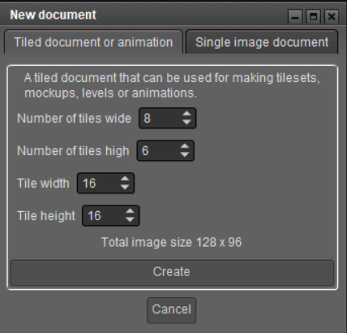
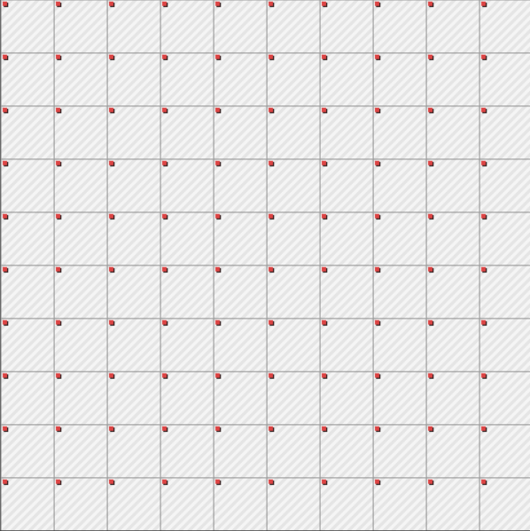
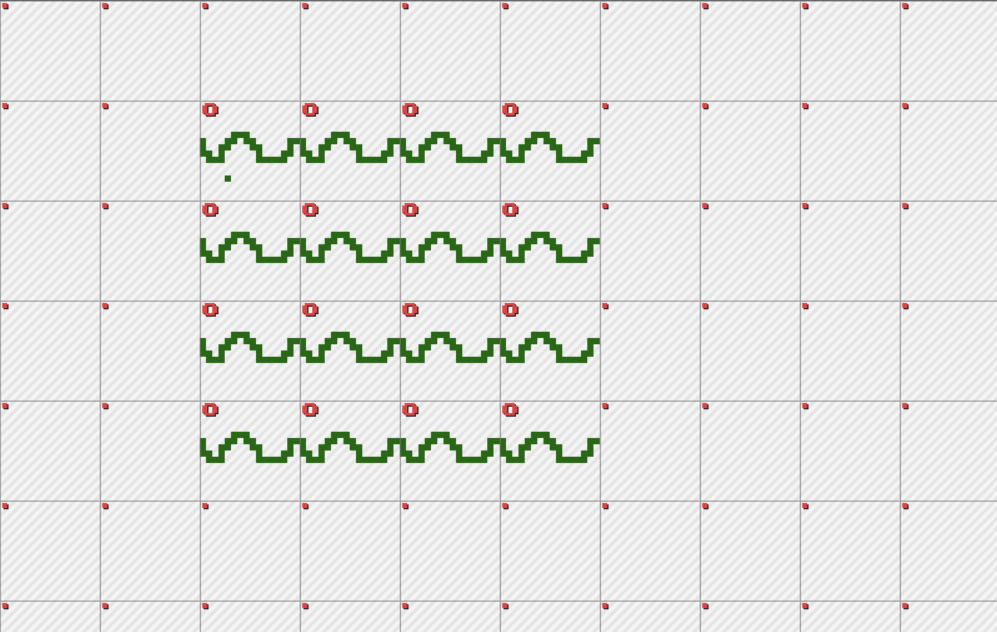
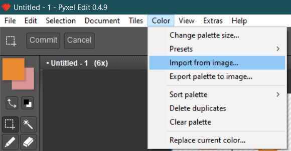
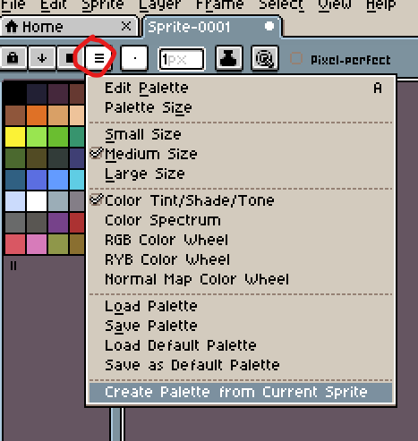
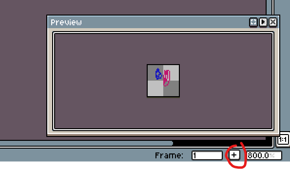
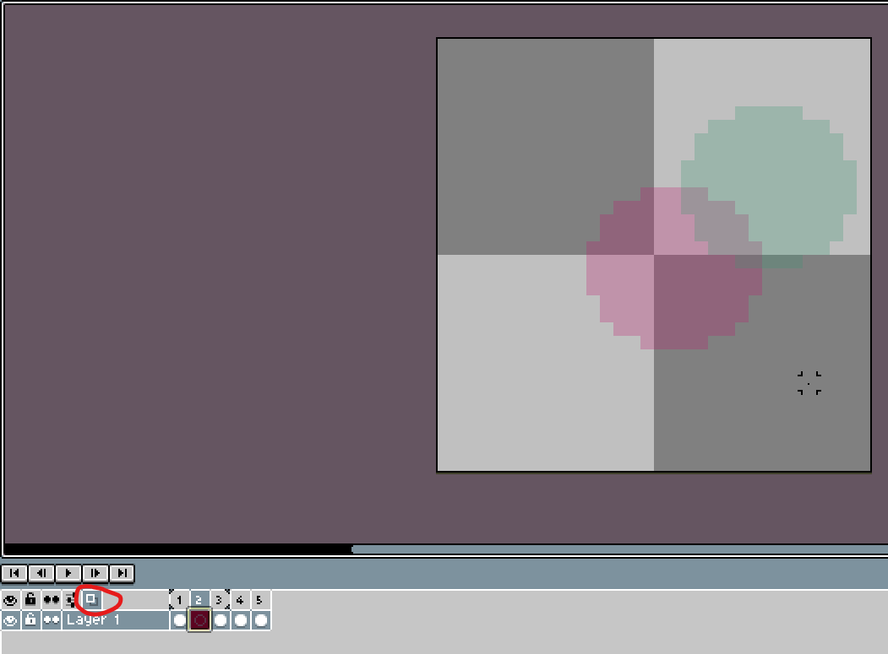

# [Mislav Majdandžić's](https://www.udemy.com/user/mislav-majdandzic/) Pixel Art Master Course - Beginner to Professional/Freelance

This README is aimed to store knowledge and lessons learned from the [course](https://www.udemy.com/course/pixel-art-master-course/).

I am using [Pyxel Edit](https://pyxeledit.com/) to make tiles and [Aseprite](https://www.aseprite.org/) to make characters and animations.

**Note**: The PNGs created to demonstrate a theory should be opened individually, since the resolution is very low here.

## Table of contents
- [Pyxel Edit](#pyxel-edit)
    - [Single image document](#single-image-document)
    - [Tiled document or animation](#tiled-document-or-animation)
- [Asesprite](#asesprite)
    - [Animation](#animation)
- [Lines and shapes](#lines-and-shapes)
    - [Lines](#lines)
    - [Curves](#curves)

## Pyxel Edit

First off, we can create a new document in `File/New...`:

There, we have two types of documents, `Tiled document or animation` and `Single image document`.

### Single image document

In `Single image document` we can choose the width and height of our canvas, and create. We can `Use clipboard size` if we have copied an image from the web to get its size:

We can move the canvas around by holding `Space bar` and left-clicking it, or clicking the scroll wheel of the mouse.

The tools are located in the left panel. We can see each shortcut by hovering the mouse over.

We can also change the color there:

In the upper-left, we have the tool properties for a selected tool, like changing size, shape, line, scatter (randomness of the tool), opacity, density, and so on.

**Opacity and density should be avoided altogether. We only need shape and size.**

For the `Bucket` tool, we have three options: `Use all layers`, which paints all the layers, if we're animating (which we won't in this software), `Contiguous`, which only fills an area that is closed, like a shape, and `Restrict to tile`, which only fills inside tile boundaries.

This tool changes the color of all objects of the same color, if `Contiguous` is off.

A useful shortcut to `Color picker` is left-clicking a color.

The `Magic Wand` is a selection tool, and it works similarly to `Bucket`. This tool and `Selection tool` **restrict the area to where we can draw or paint**.

We can move the selected items by holding `Ctrl` on Windows.

`Color replacer` swaps colors. It's useful if we want to replace a color for our entire image.

### Tiled document or animation

Now, to the interesting part of this tool: tile creation.

We can create a neu document and select `Tiled document or animation`.

We can choose the number of tiles in width and height. Each tile has its own size:

We can create or delete custom color palets in the right panel. We also have the tile tools there:

If we hit `Tab`, we will `Toggle show tile indices` and some little red squares will show up at the upper-left corner of the tiles. This means that there isn't any tiles added to the tiles we're seeing:

If we click on `Tile placer tool` and draw over some tiles, this will group them together, making a `0` appear instead of the red squares. Now, if we draw on one tile, **all of the tiles grouped will be drawn as well**:

Another feature of this tiling system is that we can add a created tile to the `Tiles` pallet, on the right panel, and later replicate it to other tiles:

Here we have two placed tiles, `0` and `1`. They are both added to the `Tiles` on the left.

We can clear a placed tile by right clicking on `Clear tile` in the `Tiles` pallet:

In this context, `Fill  outside tile` in the `Bucket` (and `Magic Wand`) tool works to color everything,because it's limited to a tile when we use it with that option unselected.

We can resize our canvas or tiles by going to `Document/Resize canvas...` or `Resize tiles...`:

We can import or export our own color pallets by going to `Color`:

## Asesprite

The usual `File/New...`. We can create a `New Sprite` by choosing the width and height of our canvas.

The tools are located on the left side:

The options are located at the top-left. For the `Pen` tool we can select the type of the brush, size, ink, and the `pixel-perfect` option, which trims some pixels on the edge of drawings. This option should be avoided, because it doesn't do it perfectly.

We can draw a straight line by drawing a point and holding `Shift`. Or we can also use the `Line Tool`

We can also see the dimensions of a drawing by holding `Ctrl` in the canvas.

We have the `Marquee Tool`, which allows us to select objects. There are some options there, like lasso and elliptical, but the ost interesting is the `Magic Wand Tool`, which allows us to select specific colors on the canvas (when the tool option `Contiguous` is enabled), as long as the tool option `Tolerance` is set to `0`, which it always should.

`Alt` is a shortcut to the `Eyedropper`.

There other tools are the standard.

The `Bucket Tool` also has a `Gradient Tool`, to make a gradients with two colors. It also has `Dithering` effects, which can be chosen in the tool options.

**Stay away from the `Blur Tool` altogether!**

We can create color pallets from the current sprite here:

This useful to get the pallet from other artists.

### Animation

We can add frames in the bottom, by clicking the `New Frame` button, or hitting `Alt + N`:

We can add new layers to a frame by hitting `Shift + N`:

To create an animation in a layer, we can create new frames and draw in them. We can select how many frames we want to play by selecting them with `Shift`. WE can hit the play button in the `Preview` window to watch our animation.

We can use the `Onion Skin` tool to see the previous and next frames of an animation. It's useful if we want to animate something in between:

In this image, we're at the second frame. It shows the first and the third frames so that we can draw something accurately in between them.

## Lines and shapes

**Note**: We shouldn't use the features of the editing software to create lines and curves for us. It's not good practice. Even the software makes mistake.

### Lines

We use **ratios** for diagonal lines.

For a 45° we use a ratio of 1x1 pixel. For lower angles, we use 1xn pixels. For higher angles, we use nx1 pixels:

We also have ratios with fractions, like 1x1.5, but we'll learn about them later.

### Curves

Curved lines are a bit trickier, because we need to be sure that we aim for the curvatures to be correct.

We generally need to clean a curvature by **removing the pixels that are neighbors to the core pixel and do not continue on the same direction**.

For example, int this curve:

We can clean it up by removing these neighbors. We also don't want 90° angles when we create curved lines, so, even if the neighbors are removed, we can clean it up more by discontinuing the line. Duplicated pixels should also be deleted.

The final result:

### Shapes

They are nothing more than a closed line. The most difficult shape here is a circle. There are some techniques to draw them.

These are the steps to create a circle:

1. Draw a square at the desired size;
2. clean up the edges;
3. Repeat the process.

We can change the patter of the pixels as well, just like in this example:

### Challenges from this section

Challenge one:

Challenge two:
